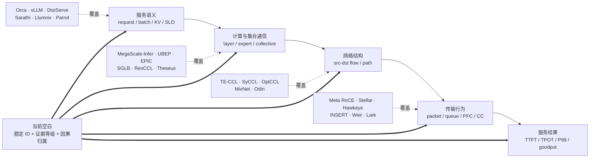
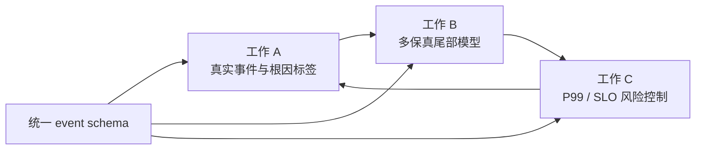

# AIDC 推理测量、仿真与传输长尾：调研、实验证据与创新工作设计

- 日期：2026-09-26
- 范围：SIGCOMM、INFOCOM、NSDI、OSDI、SOSP、MLSys、SC、FAST、ISCA、ISPASS、IISWC 及紧邻工作
- 结构化文献表：[literature_ledger.csv](literature_ledger.csv)（96 项）
- 检索与纳入规则：[search-protocol.md](search-protocol.md)

## 摘要

本报告把三类证据放到同一条链上：顶会已有工作、当前 SimAI/LLMServingSim/ns-3
实验、四卡 A100 的 MoE A2A 校准。结论不是“再做一个仿真器”，而是把仍未闭合的
问题收敛为：**推理语义怎样穿过 collective、rank-pair flow、packet/queue，最终解释
TTFT/TPOT/P99/SLO goodput 的长尾；又怎样在可承受的仿真成本下反过来控制 collective。**

核心判断如下：

1. 服务系统已经很好地优化 request、batch、KV 和 prefill/decode，但通常把网络压成阶段总时长；
   网络工作已经深入 flow、packet、PFC 和 collective schedule，但通常丢失 request、layer、expert
   与 SLO 语义。二者之间仍有一个“归属断层”。
2. 单纯把 LLMServingSim/SimAI 接到 ns-3 不构成充分创新：SimAI、ASTRA-sim、Arcadia、
   Wormhole、DistriAI 等已经覆盖类似平台或后端。研究价值应放在 **语义关联、真实校准、
   尾部不确定性和闭环控制**。
3. 本地实验发现 MoE A2A 对倾斜并非单调：中度热点可能比极端 Zipf 更慢。总 bytes、最大
   peer bytes 或“越倾斜越慢”都不足以预测完成时间，必须保留完整 `src-dst` 矩阵、方向、
   非零 peer 数和 runtime chunk/channel 调度。
4. “代表性的中间时间切片”已经有严格闭环：48 个 block 中选 block 24，将同一组
   AllReduce/AllGather/ReduceScatter 下钻为 8 条 flow、WQE task、68 个 4 KiB 包、switch hop、
   queue 和 port 事件，粒度从 520.639 μs 到 10 ns。
5. 最值得推进的三项共享工作是：A）collective 语义感知的跨层可观测与根因诊断；
   B）真实校准、矩阵感知、多保真 MoE 长尾仿真；C）直接优化 P99 和 SLO goodput 的风险感知
   collective 控制。三者共享一份 canonical event schema，可分开投稿，也可形成系统主线。

## 1. 证据口径

全文严格区分以下口径，不用“profile”一词掩盖来源差异：

| 标签 | 定义 | 当前实例 | 能证明什么 | 不能证明什么 |
|---|---|---|---|---|
| `measured` | 实机 profiler/NIC/capture 直接观测 | 四卡 A100 NCCL replay | 指定机器和软件栈的真实延迟分布 | EP=320、多机 fabric 的绝对性能 |
| `profile-derived` | 性能库或离线 profile 查表 | LLMServingSim GPU operator duration | 指定 profile 条目的计算时间 | 当前机器实时测量值 |
| `trace-derived` | 框架 trace 直接给出的语义/bytes | collective 类型、逻辑 bytes | 操作顺序和逻辑通信量 | NCCL 实际 peer/channel schedule |
| `algorithm-projected` | 根据明确算法展开 | 两 rank ring 的 8 条 flow | 假设算法下的 `src,dst,bytes,dependency` | runtime 真正选择了该 schedule |
| `analytical` | 公式/带宽模型求值 | SimAI、ASTRA analytical | 模型参数下的趋势和快速筛选 | packet queue、PFC、真实尾部 |
| `ns3-simulated` | 指定 topology/transport 参数的离散事件结果 | task/packet/hop/queue trace | 该配置内的因果时序 | A100 或生产 fabric 实测 |

所有论文中的“报告值”只表示论文覆盖范围，不自动变成本地实验结果。完整字段和边界见
[literature_ledger.csv](literature_ledger.csv)。

## 2. 文献版图

### 2.1 检索覆盖，而不是只列熟悉论文


**图 1：96 项文献按会议和研究对象分类。**
数据来源：`research/literature_ledger.csv`；由 `tools/build_literature_figures.py` 确定性生成。
物理量：横轴和段内数字均为纳入账本的论文数量（篇）；颜色区分推理服务/运行时、测量/仿真、
网络/collective。
证据边界：数量表示本课题检索覆盖，不表示会议质量或各会议全部产出；SC Workshop 与
SIGCOMM Poster 单列，未混入主会。完整检索词、纳入/排除规则和剩余边界见
[search-protocol.md](search-protocol.md)。

### 2.2 按研究对象分类



**图 2：文献覆盖与归属断层。**
数据来源：本报告的 96 项文献账本；节点表示论文的主要测量/优化对象。
物理量：本图不编码数值，表达语义层、collective 层、flow/packet 层和服务指标之间的关联。
证据边界：一篇论文可能跨多层；图中只标其主要贡献，不表示其他层完全缺失。

### 2.3 五类工作及其边界

| 类别 | 代表工作 | 已经解决 | 对本课题仍缺 |
|---|---|---|---|
| 服务调度与内存 | Orca、vLLM、DistServe、Sarathi、SOLA、JITServe、NanoFlow、LoongServe、Hetis | batching、KV 管理、PD 分离、动态并行、抢占和 SLO goodput | collective/flow/queue 对某个 request 尾部的因果归属 |
| KV/推理网络 | CacheGen、HACK、ARK、KVServe、DualPath、Turbo、GIGANETS | KV 压缩、路由碰撞、存储 I/O、网内聚合和架构协同 | MoE EP 的动态 `src-dst` 矩阵与同步尾部 |
| 仿真与 workload | SimAI、LLMServingSim 2.0、Vidur、Frontier、Calculon、Wormhole、Arcadia、ServeGen、DistriAI、Nüwa | 请求/算子/flow/packet 多种保真度和大规模执行 | runtime flow 真值、跨保真尾部校准及不确定性 |
| collective/EP 优化 | TE-CCL、SGLB、COMET、UBEP、EPIC、Odin、PReCCL、Theseus、OptCCL、hZCCL | 调度、压缩、重叠、A2A CC、遥测和 schedule 切换 | 从 request/expert 风险到控制目标的统一接口 |
| 网络测量与诊断 | LLM-Pilot、Mycroft、R-Pingmesh、Hawkeye、RDMATracer、Anytest、INSERT、Weir | service/collective/path/PFC/RDMA/RNIC 的测量与诊断 | 与 layer、expert、packet queue、request SLO 的完整稳定 correlation |

### 2.4 按会议观察

- **SIGCOMM** 近三年最集中：2024 年偏 AI fabric、RoCE、collective 调度与监控；2025 年进入
  MoE 服务、KV 压缩、光电 fabric 和 collective resource scheduling；2026 年进一步出现 EP
  library、A2A CC、in-band telemetry、runtime schedule、KV 路由和 AI 仿真控制面。
- **NSDI/OSDI/SOSP** 更关注端到端系统语义、调度、模拟框架和可部署性。SimAI、Arcadia、
  Wormhole、Phantora 说明“有网络后端的模拟平台”本身已拥挤；DistServe、Sarathi 等则说明最终
  指标必须回到 TTFT/TPOT/SLO goodput。
- **INFOCOM** 除 RDMA telemetry、RNIC cache、packet scheduling 和 emulation 外，已经出现
  Mell、Online Context Caching、serverless MoE deployment 等直接 LLM/MoE serving 工作；因此不能再
  概括为只有网络支撑原语，但其 AIDC fabric/collective 密度仍低于 SIGCOMM。
- **MLSys** 已覆盖 SiDA、SOLA、ThunderServe、Seesaw、FlashInfer、COMET 等 MoE serving、SLO、
  动态并行和 compute-communication overlap；新的工作必须明确不重复一般 serving scheduler 或 overlap。
- **SC** 从 DeepSpeed-Inference、Calculon 扩展到 LLM-Pilot、PipeInfer、Hetis、gLLM、Diff-MoE 和
  resilience measurement，说明 HPC 社区同时覆盖测量、运行时、异构并行和 MoE 缓存。
- **IISWC/ISPASS/PACMI** 提供 LLMServingSim、LLMServingSim 2.0、Frontier 这类 profile-driven
  仿真骨架，适合作为实验平台，而不是直接作为创新点。

## 3. 当前到底跑了哪些实验，是否有代表性

| 层次 | 已完成实验 | 规模与关键结果 | 代表性 | 主要限制 |
|---|---|---|---|---|
| A100 实机 | EP=2/4 A2A、Top-K、倾斜、MoE replay | 512 KiB/2 MiB/4 MiB 均值 87.1/267.2/511.1 μs；4 MiB 标准差 61.3 μs | 真实启动项、payload、方向和 replay 开销 | 单机 SHM，不代表跨节点 IB/RoCE |
| SimAI analytical | micro 与 9,216-GPU workload | 9,216-GPU case 中 exposed communication 占 35.21%，EP+DP_EP 为主 | 大规模域分解和筛选 | 没有 packet queue；workload 不是 runtime truth |
| LLMServingSim 最小必要 case | dense 1 GPU、MoE 2 GPU | dense TTFT 12.598 ms；MoE TTFT 30.887 ms；抽取 48 层中的 block 24 | 验证 request→layer→collective 语义粒度 | 单请求；profile 为 RTXPRO6000，不是 A100 |
| EP=320 可扩展性 | LLMServingSim 与 Frontier | 40 节点×8 NPU 跑通；LLMServingSim 约 22.4 min/30 GB，Frontier 506.7 s/2.18 GB | 证明目标规模在 analytical 层可执行 | 模型/链路有占位参数，不用于绝对精度 |
| SimCCL 结构 | 8-rank 4 MiB AllToAll | 56=`8×7` 条 flow，每条 512 KiB | 验证 collective→pair flow 接口 | 没有 launch/FCT，且不是 LLM block 24 本身 |
| 同 collective ns-3 闭环 | block 24 的 AR/AG/RS | 8/8 task 完成；组合终点 520.639 μs；task 4 为 68 个 4 KiB 包 | 验证 block→phase→flow→packet→queue 粒度 | 两 rank、单交换机、400 Gbps 合成网络 |

所以这些实验具有**方法代表性**和**局部机制代表性**，但还不具有生产 EP=320 的**统计代表性**。
它们足以证明数据合同、守恒、粒度和几个反直觉现象；尚不足以声明真实生产 P99 或某方案的
端到端收益。

## 4. SimAI 及 workload：优缺点

### 优点

- workload 用统一层记录 TP/EP/DP/PP、compute、collective、bytes 和依赖，适合千卡级 what-if；
- analytical backend 快，可先做并行策略、带宽和暴露通信筛选；
- SimCCL 能将 collective 展开成 `src_rank,dst_rank,bytes`，恰好是网络仿真的中间接口；
- compute 与 communication 共用 layer/phase 标签，容易形成 GPU/NIC 共轴事件流；
- 训练态大规模校准较完整，SimAI 论文报告平均 98.1% 与真实结果对齐。

### 缺点

- workload 是模型输入，不是 runtime trace；未经实机校准的 compute 和 bytes 不能标成 measured；
- analytical 模型看不到 queue、HOL、PFC/CC、路由冲突和 packet-level tail；
- 推理态 MoE 对 per-pair 路由倾斜、DeepEP/IBGDA 和 A100 profile 的支持仍不足；
- SimCCL standalone 给结构但不给网络完成时间，`parent_flow_ids/prev_flow_ids` 等字段也必须逐版本核验；
- 320 rank 高频 decode 若全部进入 ns-3，事件量不可承受，必须先筛 slice 或采用多保真策略。

## 5. LLMServingSim 的必要实验与边界

已经完成的最小组合有四个目的：

1. **dense 单 GPU**：核对 request 到 batch、layer 和 TTFT/TPOT 输出；
2. **2-GPU MoE**：确认 TP/EP、collective 类型、bytes 和 rank-local expert 的语义；
3. **EP=320 analytical**：只验证 scale 和资源成本，不把占位链路的 TPOT 当物理结论；
4. **block 24 端到端闭环**：选定一个中间 slice，把其同一组 collective 投影到 ns-3，避免
   早期“LLM block 与另一个独立 AllToAll case 并排展示”的证据错配。

LLMServingSim 的优势是 request/continuous batching/KV/layer 语义完整，计算由 profile 驱动；
主要不足是文本 trace 的 compute 有 duration，而 collective 通常只有类型和 bytes，没有逐操作
runtime timestamp，更没有 NCCL peer/channel truth。因此报告中的 collective 时间必须明确标为
`reconstructed`、`analytical` 或 `ns3-simulated`。

## 6. “代表性的中间时间切片、集合通信详细 profile”如何体现

### 6.1 为什么选择 block 24

本次 MoE prefill 有 48 个重复 transformer block。block 24 位于中部，避开 embedding、首次初始化
和输出尾部，同时包含 dense attention、AllReduce、MoE dispatch、rank-local expert 和
ReduceScatter。邻近 block 的结构重复，选择依据是位置和结构，而不是看到网络结果后再挑最快或
最慢样本。


**图 3：同一 collective 的数据血缘。**
数据来源：LLMServingSim block 24 event、`flow_manifest.csv`、ns-3 `traffic.csv` 和 runlog。
物理量：本图不编码数值，表达 `collective_id → flow_id → task_id → packet PSN/port event` 的关联。
证据类型：collective 为 trace-derived；flow 为 two-rank-ring algorithm-projected；task 以后为
ns3-simulated。箭头不表示已得到真实 NCCL channel schedule。

### 6.2 计算和网络各自的时间图


**图 4：GPU0/NIC0/GPU1/NIC1 共轴时间线。**
数据来源：`block24_unified_events.csv`；GPU duration 来自 LLMServingSim profile，NIC task
start/complete 来自 ns-3 TaskTrace。  
物理量：横轴为相对 block 24 起点的时间（μs），条宽是 operation/WQE duration（μs）。  
证据边界：GPU 为 profile-derived，NIC 为 ns3-simulated；采用保守串行组合，没有声称真实 overlap。

| 阶段 | 每方向 payload | 开始（μs） | 完成（μs） | 跨度（μs） |
|---|---:|---:|---:|---:|
| Dense attention compute | 每 GPU 同路径 | 0.000000 | 36.330000 | 36.330000 |
| AllReduce reduce-scatter | 262,144 B | 36.330000 | 42.472840 | 6.142840 |
| AllReduce allgather | 262,144 B | 42.492840 | 48.633760 | 6.140920 |
| LayerNorm | 每 GPU 2.549 μs | 48.653760 | 51.202760 | 2.549000 |
| MoE AllGather | 278,528 B | 51.202760 | 57.729520 | 6.526760 |
| expert_297 / expert_299 | 两 GPU 并行 | 57.749520 | 514.486520 | 456.737000 |
| MoE ReduceScatter | 262,144 B | 514.486520 | 520.639360 | 6.152840 |

这张图直接回答“某一个计算是谁在跑”：GPU0 执行 `expert_297`，GPU1 执行 `expert_299`，
各 456.737 μs，二者并行，不能相加。

### 6.3 collective 中谁到谁、耗时多少


**图 5：8 条 rank-pair flow 的方向、payload 和完成口径。**
数据来源：`block24_task_profile.csv`，由 flow manifest 与 ns-3 task statistics 按 `task_id` 连接。  
物理量：纵轴为 duration（μs）；柱为 WQE start→complete，点为 first-packet→last-ACK；标签给出
方向和 payload（KiB）。  
证据边界：两个方向是同一 phase 的并行参与者，不能相加；WQE completion 和 ACK envelope 是
不同物理事件。

8/8 task 完成。WQE FCT 的 min/median/mean/max 为 6.126/6.142/6.232/6.527 μs；
packet envelope 对应为 6.180/6.188/6.284/6.579 μs。

### 6.4 再下钻一条 flow 到 packet/hop/queue

选 task 4：`req0.batch0.block24.moe_allgather`，rank 0→1，278,528 B。它被分为
68 个 4 KiB data packet 和 5 个 WQE segment。


**图 6：task 4 的逐包逐跳 profile。**
数据来源：`block24_packet_profile.csv`、AllPacketTrace、QueueTrace 和 task parser。  
物理量：上图为 source→switch、switch dwell、switch→destination 的 forward latency（ns）；下图为
相对 task start 的事件时间（μs）；queue occupancy 为 B。  
证据边界：这些都是当前 400 Gbps、单交换机配置下的 ns3-simulated 值，不是硬件 buffer counter。

两段链路延迟稳定在 103–104 ns，switch dwell 却从 10 ns 增长到 518 ns，中位数 255 ns；
forward packet latency 因而从 217 ns 展宽到 725 ns，目的端口最大记录 queue occupancy 为 29,607 B。
这说明只有 packet/hop 级 trace 才能把传播和排队分开。

### 6.5 粒度到底有多细

```text
request/batch/block        520.639 μs
└── collective phase        6.14–12.30 μs
    └── rank-pair flow      6.13–6.53 μs
        └── WQE segment
            └── 4 KiB packet
                └── link hop   103–104 ns
                └── switch dwell 10–518 ns
```

因此“看一看粒度”不是只画一张总体时间线，而是证明同一稳定 ID 可以从数百微秒的 block
一直下钻到十纳秒级 switch event，并且每一层都说明来源、物理量和完成口径。

## 7. 当前最重要的实验发现

### 7.1 固定平均值不足以描述 A2A

四卡 A100 中，512 KiB、2 MiB、4 MiB 的均值为 87.1、267.2、511.1 μs；4 MiB 标准差
61.3 μs。校准拟合为：

- peer=1：`T = 30.6 μs + 68.2 μs/MB × bytes`；
- peer=3：`T = 42.1 μs + 116.1 μs/MB × bytes`。

两式只适用于当前单机 SHM 路径。peer 数只有 1 和 3 两个点，不能据此宣称可外推到 319 peers。

### 7.2 裸微基准系统性偏乐观

replay 内嵌 A2A 比相同量级的裸 benchmark 慢约 30%–60%。Dispatch 还包含约 285 μs pack
固定开销和 120–145 μs count 交换。只用 `bytes/bandwidth` 或裸 A2A 校准会漏掉 endpoint、
同步和 API 组织成本。

### 7.3 “倾斜越大越慢”不成立

EP=2、B=256 的 A2A 在 balanced/hot-0.25/hot-0.5/hot-0.75/Zipf 下并非单调；hot-0.25
达到约 837 μs，而更极端的 Zipf 约 698 μs。总字节相同，最大 peer 流量单调增加，时间却不单调。
最合理的待验证机制是方向性、非零 peer 数和 NCCL chunk/channel 调度共同改变有效并行度。

这个现象是当前最有科学价值的本地发现，但还只是 EP=2/4、SHM 场景。下一步必须在多节点
IB/RoCE 或 DeepEP/NVSHMEM 路径复验，形成 routing-skew × message-size × peer-count 的 phase diagram。

### 7.4 平均端口利用率可能误导

block 24 的端口统计窗口包含 456.737 μs expert compute gap，因此全窗口平均仅约 18.2 Gbps；
这不等于通信 burst 只利用 4.5% 的 400 Gbps。网络图必须同时报告 active-burst rate、完整 phase
窗口和端口观察窗口。

## 8. 真实场景的流怎样提供给 ns-3

### 8.1 canonical flow schema

```text
collective_id, phase_id, op, group_id,
src_rank, dst_rank, bytes,
launch_offset_ns, dependency_ids,
request_id, batch_id, layer_id, expert_id,
channel_id, chunk_id,
rank_to_host_mapping, evidence_source
```

ns-3 的 `traffic.csv` 只是其网络投影：rank 映射为 node，bytes 映射为 payload，launch/dependency
映射为 delay/phase DAG。不要从“这里有一个 AllToAll”直接跳到 packet trace。

### 8.2 三条采集路线

| 路线 | 直接得到 | 优点 | 风险/缺口 |
|---|---|---|---|
| framework/NVTX + profiler + collective 展开 | layer、collective、group、tensor bytes | 工程成本最低，当前已跑通 | peer/channel 是模型，不是 runtime truth |
| NCCL net-plugin/transport instrumentation | channel、peer、bytes、timestamp、collective correlation | 最接近真实 P2P flow | 侵入性、时钟同步、GPU-initiated RDMA 可见性 |
| NIC/IB telemetry 或 capture | port bytes、packet/FCT/counter | 可校准网络行为 | 很难从 packet 反推 request/layer/collective |

推荐组合是：第一条提供语义骨架，第二条提供 runtime flow 真值，第三条做 aggregate/network
校准。所有 rank 先做时钟对齐和 send/recv 配对，再做 per-rank/collective 字节守恒、peer 对称性和
DAG 无环检查，最后才生成 ns-3 输入。

## 9. 研究空白与三项可验证工作

### 工作 A：collective 语义感知的跨层可观测与根因诊断

**假设。** 只要保留 request→layer/expert→collective→flow→packet/queue 的稳定关联，并把
endpoint wait、pack/count、fabric queue 和 GPU straggler 分开，就能比纯 NIC telemetry 或纯
endpoint timestamp 更准确地归属 TPOT/P99 尾部。

| 要素 | 设计 |
|---|---|
| 原型 | NVTX/correlation + NCCL net-plugin hook + NIC/IB telemetry + canonical event schema |
| Baseline | Nsight/NCCL logs、LLM-Pilot、Mycroft、R-Pingmesh、Hawkeye、RDMATracer、Taking the Pulse、PReCCL |
| 数据 | 本地 A100 replay、可控注入 queue/PFC/endpoint contention、真实 serving trace |
| 指标 | root-cause precision/recall、timestamp error、bytes conservation、overhead、可覆盖事件比例 |
| 可证伪条件 | 跨层关联不能显著优于 endpoint-only/network-only；或 instrumentation 开销破坏 workload |
| 投稿定位 | SIGCOMM/NSDI measurement + systems；强调 serving semantic attribution，不重复一般 RDMA tracing |

### 工作 B：真实校准、矩阵感知的多保真 MoE 传输长尾仿真器

**假设。** `完整 src-dst 矩阵 + runtime 调度 + endpoint 固定项 + 少量逐包 slice` 能以远低于
全量 ns-3 的成本预测 P95/P99，并解释“中度倾斜最差”等非单调区域；单一 α-β 或总 bytes 模型做不到。

| 要素 | 设计 |
|---|---|
| 原型 | analytical 快扫 → flow-event 仿真 → 触发式 ns-3 packet 下钻；三层共享 event ID |
| Baseline | SimAI/ASTRA analytical、LLMServingSim 2.0、Frontier、Calculon、m3、全量 ns-3、Wormhole |
| 数据 | balanced/hot/Zipf/真实 gate 矩阵；EP=2/4/8 与多节点；不同 K、batch、chunk、CC |
| 指标 | mean/P95/P99 error、分位数置信区间、rank order、runtime/memory、下钻比例 |
| 可证伪条件 | 完整矩阵对尾部无额外解释力；或 packet slice 不能改善尾部分位数且成本无优势 |
| 投稿定位 | MLSys/NSDI/SIGCOMM；贡献是 tail fidelity 和 uncertainty，不是“又一个 ns-3 backend” |

### 工作 C：面向 P99 与 SLO goodput 的风险感知 collective 控制

**假设。** 以 `E[T] + λ·CVaR/P99 risk` 和 request criticality 为目标，在 router、schedule、path、
chunk/channel、compression 之间联合选择，能提高 SLO goodput，即使平均 collective time 不总是最小。

| 要素 | 设计 |
|---|---|
| 原型 | 工作 B 的 risk oracle + LLMServingSim request scheduler + 可切换 collective/route 控制器 |
| Baseline | balanced routing、bytes-only、SOLA、JITServe、FastServe、SGLB、Odin、Theseus、EPIC/UBEP 可复现策略 |
| 数据 | BurstGPT/ServeGen 请求流 + synthetic/real gate 矩阵 + 背景流和故障注入 |
| 指标 | TTFT/TPOT P95/P99、SLO attainment/goodput、平均吞吐、公平性、控制开销 |
| 可证伪条件 | 风险控制只牺牲平均吞吐而不改善 SLO goodput；或收益完全由现有 A2A CC 解释 |
| 投稿定位 | NSDI/SIGCOMM/MLSys；强调从 collective risk 到 serving SLO 的闭环 |

三项工作的依赖关系如下：



**图 7：三项工作闭环。**
数据来源：本报告的研究空白审计和当前实验接口。
物理量：不编码数值；箭头表示校准数据、风险预测和在线反馈。
证据边界：这是待验证研究设计，不是已实现系统或性能结果。

## 10. 与 2026 年近期工作的重复性审计

| 已有工作 | 已覆盖 | 本报告不能再单独声称 | 仍可区分的贡献 |
|---|---|---|---|
| UBEP / EPIC | 生产 EP library 和通信优化 | “优化 MoE A2A/负载均衡” | 跨层因果归属、多保真 P99 预测、可证伪机制图 |
| Odin | All-to-All-aware CC | “为 A2A 设计 CC” | request/expert criticality 与 SLO risk objective |
| PReCCL | in-band telemetry + workload reallocation | “遥测驱动 collective 重分配” | GPU/serving 语义、endpoint/fabric 分因、模拟校准闭环 |
| Theseus / OptCCL | runtime schedule 切换和最优合成 | “动态选择 collective schedule” | 用可解释的尾部风险信号选择，并落到 TPOT/P99 |
| Nüwa / Arcadia / Wormhole | 大规模控制面、跨层平台、包仿真加速 | “可扩展 AI 网络仿真平台” | representative-slice 选择、跨保真不确定性、生产流重建 |
| Taking the Pulse | endpoint timestamp 诊断 | “用端点时间诊断 collective” | 联合 net-plugin/NIC/queue 真值及 request/collective correlation |
| Mycroft | collective dependency tracing | “追踪 collective 依赖” | 推理 request/expert 语义、网络队列真值和 SLO 归属 |
| COMET | MoE 计算通信细粒度重叠 | “细粒度 overlap MoE” | 非单调传输长尾的测量/预测与风险控制，而非 kernel overlap 本身 |
| SOLA / JITServe / FastServe | SLO、请求不确定性和抢占调度 | “SLO-aware serving scheduler” | 将可解释的 collective P99/CVaR 作为新风险输入并做端到端因果验证 |
| LLM-Pilot / LLM-Inference-Bench | 推理配置表征和 benchmark | “做 LLM inference benchmark” | request→collective→packet 的归属、运行时流真值和多保真尾部模型 |

### 10.1 可拆分创新点的优先级

| 优先级 | 科学问题 | 最小可验证产物 | 最大风险 | 建议归属 |
|---:|---|---|---|---|
| 1 | 为什么中度倾斜可能比极端倾斜更慢 | routing-skew × size × peer-count phase diagram；runtime channel trace | 现象只在 SHM/EP=2 出现 | 工作 B 的核心机制论文 |
| 2 | endpoint、GPU 同步与 fabric queue 各贡献多少尾部 | 三源同时采集和受控故障注入的 root-cause confusion matrix | NCCL/IB timestamp 无法可靠关联 | 工作 A 的核心系统论文 |
| 3 | 何时需要从 flow 模型下钻到 packet | 以误差/不确定性触发的 representative-slice/importance sampler | 触发规则不能优于随机采样 | 工作 B 的可扩展性贡献 |
| 4 | collective risk 是否真正影响请求 SLO | mean-only、P99/CVaR、oracle 三种 controller 的 SLO goodput 对比 | 网络风险被计算/排队噪声淹没 | 工作 C 的端到端贡献 |
| 5 | 能否联合 router 语义和网络预算压缩 activation | expert criticality-aware bytes/precision/path control | 与 KV 压缩、EPIC/UBEP 重叠 | 工作 C 的扩展方向 |

## 11. 下一步最小实验集

1. 在 8 GPU、一个固定 collective 上同时采集 NVTX、NCCL peer/channel、NIC bytes/rate，先把
   `trace-derived` 与 `runtime-measured` 的差异量化；
2. 构造 20–30 个受控矩阵，覆盖 balanced、hot、Zipf、双向/单向、稀疏/稠密和相同总 bytes；
3. 对每个矩阵至少重复 100 次，报告 mean/P50/P95/P99/CI，并记录 GPU 干净度探针；
4. 只对 analytical/flow 模型误差或不确定性最高的 5% slice 触发 packet simulation；
5. 将 collective tail 映射回一个并发 serving workload，比较 bytes-only、mean-only 和 risk-aware
   三种策略的 SLO goodput；
6. 预注册可证伪条件，避免只挑支持“中度倾斜最差”的样本。

## 12. 结论

当前实验已把“有代表性的中间时间切片”从一句要求变成了可审计 artifact：选择规则明确、
同一 collective 的 ID 连续、计算和网络共轴、每条 flow 的方向和耗时可查、单条 flow 可以下钻到
packet/hop/queue，而且每张图都说明来源、物理量和边界。

下一阶段最重要的不是扩大合成 ns-3 case，而是补齐 **真实 NCCL runtime flow + 真实 fabric 校准**，
随后用多保真方法研究矩阵方向性和 tail uncertainty。只有当这些风险最终能改善 TTFT/TPOT/P99/
SLO goodput 时，研究才从“仿真分析工具”上升为完整的 AIDC 推理测量与优化工作。

## 附录：本地证据入口

- 四卡 A100 基线：`a100_ep_runtime/第02轮_EP_A2A基线_20260915/`
- 路由倾斜与 Top-K：`a100_ep_runtime/第03轮_路由倾斜与TopK_20260915/`
- EP=320 平台验证：`a100_ep_runtime/第04轮_仿真平台验证_20260917/`
- SimAI/LLMServingSim/SimCCL/ns-3 第一轮：`a100_ep_runtime/第06轮_SimAI与LLMServingSim_trace分析_20260924/`
- block 24 同 collective 闭环：`a100_ep_runtime/第07轮_Block24端到端collective_profile_20260926/`
- 本轮文献账本：`a100_ep_runtime/第08轮_AIDC推理测量优化与传输长尾调研_20260926/literature_ledger.csv`
