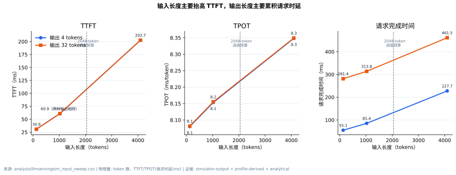
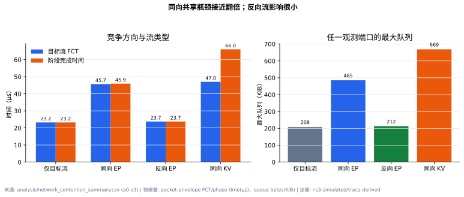
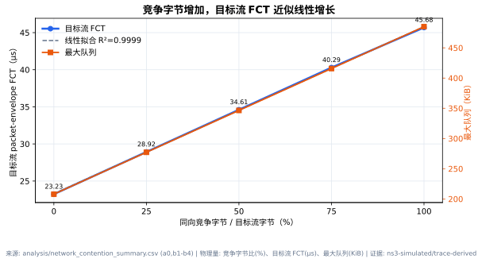
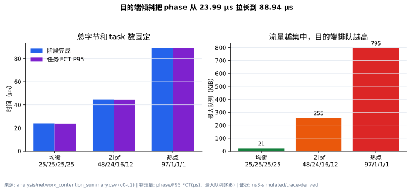
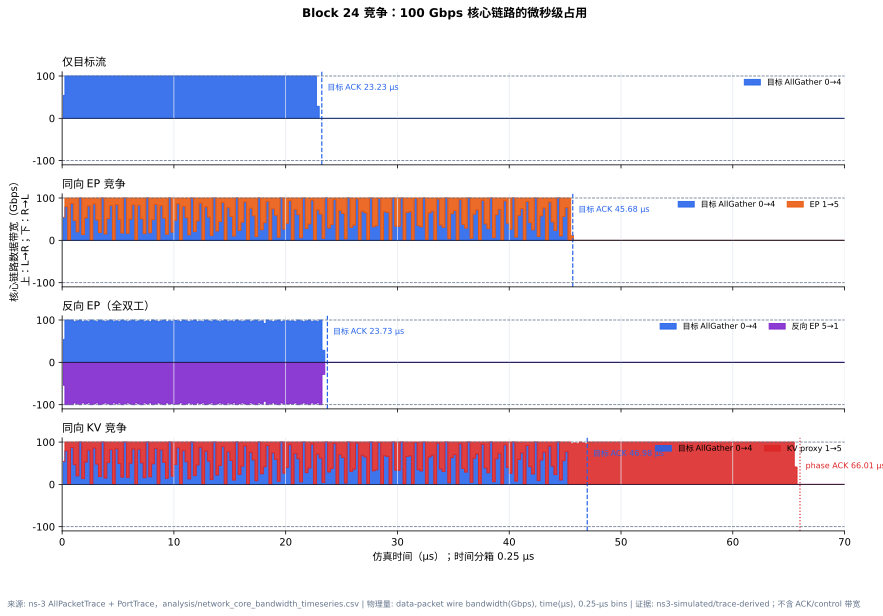
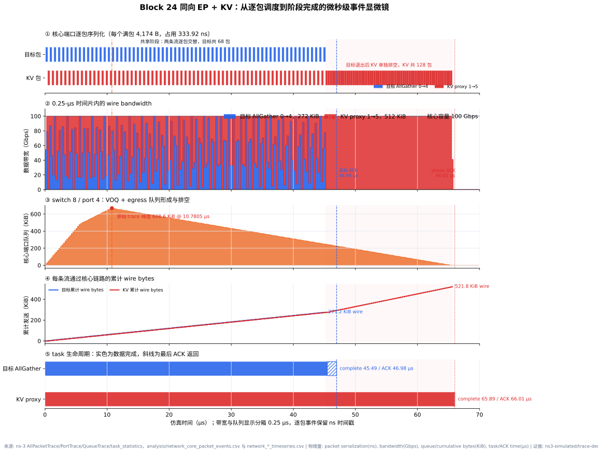
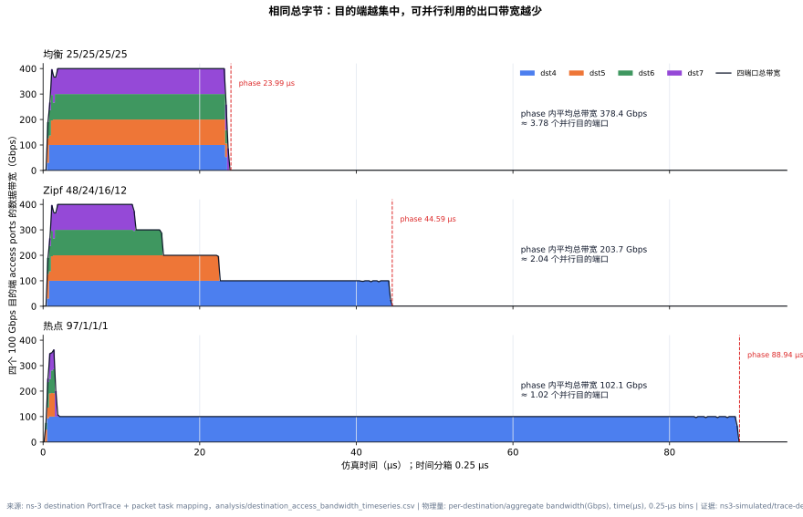
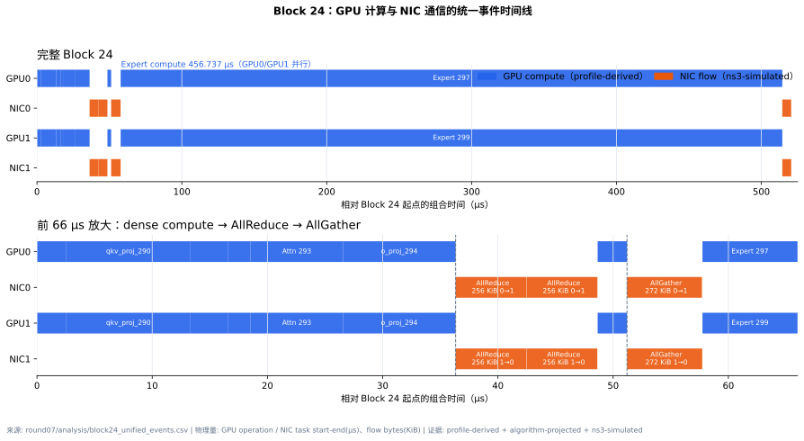
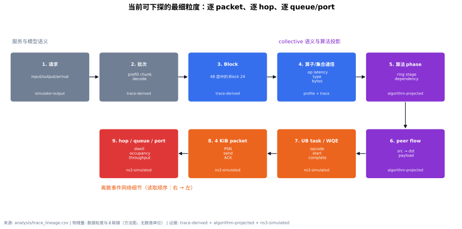
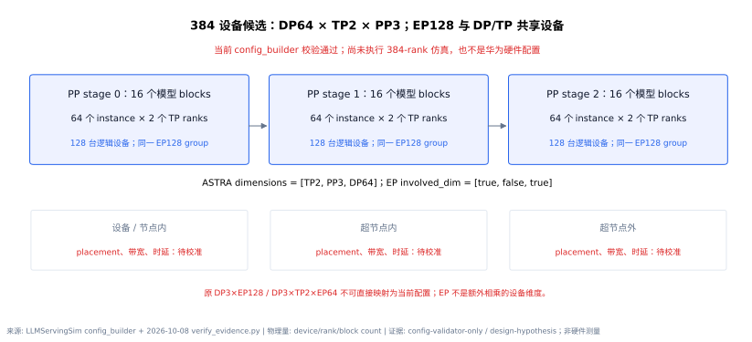

# 模型、硬件拓扑、trace 与网络竞争报告

日期：2026-09-29

## 结论先行

本轮把“模型/请求参数 → LLMServingSim trace → collective 语义 → peer flow → ns-3-UB packet/queue”串成了可核查链路，并完成 6 组请求规模实验和 11 组网络竞争实验。最重要的结论有四点：

1. **输入长度主要抬高 TTFT，输出长度主要累积请求完成时间。** 输入从 128 增至 4096 tokens 时，TTFT 从 30.887 ms 增至 202.702 ms；同一输入下输出从 4 增至 32 tokens，TTFT 不变，TPOT 基本稳定在 8.08–8.35 ms，但请求完成时间显著增加。
2. **4096-token 输入不是普通的线性放大。** 当前调度预算为 2048 tokens，4096 prompt 被拆成两个 prefill chunk，并出现 98.214 ms 的 queuing delay；因此它同时包含长序列计算和调度分块效应。
3. **网络竞争“发生在哪里、方向是否相同”比一个笼统的总带宽更重要。** 同向 EP 竞争令目标流 FCT 从 23.231 µs 增至 45.683 µs（+96.65%），反向 EP 只有 23.731 µs（+2.15%）；固定总字节和 task 数时，目的端从均衡变为 97% 热点，phase 完成时间从 23.991 µs 增至 88.935 µs。
4. **trace 已经能把服务语义下探到逐包网络事件，但 peer schedule 仍是算法投影。** 当前最细可以看到 4 KiB packet、逐 hop 驻留、queue occupancy 和 port throughput；尚未获得真实 NCCL/HCCL/DeepEP 的 channel、peer、chunk 和实机时间戳。

> 证据边界：LLMServingSim 的计算 Profile 来自 **NVIDIA RTX PRO 6000 Blackwell Server Edition**，不是 A100；网络竞争结果来自 100/400 Gbps 的代表性 ns-3-UB 拓扑，不是华为 384 超节点实测。

## 1. 本轮实验和证据分类

| 实验块 | 数量 | 变量 | 输出 | 证据类型 |
|---|---:|---|---|---|
| LLMServingSim 请求规模 sweep | 6 | input=128/1024/4096，output=4/32 | TTFT、TPOT、latency、queue delay、trace collective | `simulator-output` + `profile-derived` + `analytical` + `trace-derived` |
| Block 24 方向/类型竞争 | 4 | control、同向 EP、反向 EP、同向 KV | 目标流 FCT、phase tail、队列 | `ns3-simulated` + `trace-derived` |
| Block 24 竞争字节比 | 4 + 共用 control | 25/50/75/100% 同向竞争字节 | 目标流 FCT、最大队列 | `ns3-simulated` + `trace-derived` |
| Block 24 目的端倾斜 | 3 | 25/25/25/25、48/24/16/12、97/1/1/1 | phase、P95、最大队列 | `ns3-simulated` + `trace-derived` |

证据标签严格按以下口径使用：

- `measured`：真实硬件 profiler、NIC counter 或 packet capture 直接观测；本轮没有新的网络 `measured` 数据。
- `profile-derived`：GPU 算子时间由实机 Profile 库查表得到。
- `trace-derived`：collective 类型、逻辑 bytes 或由 trace 字段守恒统计得到。
- `algorithm-projected`：从 collective 算法展开得到 phase 和 `src → dst` peer flow。
- `analytical`：由 ASTRA analytical network 或公式计算得到。
- `ns3-simulated`：在明确拓扑、链路和协议参数下的离散事件仿真输出。

## 2. 模型、输入、GPU/NPU 与带宽台账

### 2.1 模型参数和模型大小

本轮模型是 `Qwen/Qwen3-30B-A3B-Instruct-2507`：48 层、hidden size 2048、32 个 attention heads、4 个 KV heads、head dim 128、128 个 experts、Top-8、每 expert 的 MoE intermediate size 为 768，最大上下文为 262,144 tokens，数据类型为 BF16。

按配置维度计算：

| 物理量 | 数值 | 计算/来源 |
|---|---:|---|
| 总参数量 | 30,532,122,624（30.532B） | 模型 JSON 各权重维度求和 |
| 每 token 激活参数量 | 3,353,032,704（3.353B） | 共享参数 + 每层 Top-8 experts |
| BF16 全权重 | 61.064 GB / 56.871 GiB | 总参数 × 2 B |
| KV cache / token | 98,304 B | 48 × K/V × 4 KV heads × 128 × 2 B |
| 128-token KV cache | 12 MiB | 配置推导 |
| 1024-token KV cache | 96 MiB | 配置推导 |
| 4096-token KV cache | 384 MiB | 配置推导 |

来源：`analysis/model_inventory.csv` 和 LLMServingSim 模型配置。证据为 `config-derived`；这些是结构和容量计算，不是 GPU 上的实测显存驻留。

### 2.2 计算和网络参数分别来自哪里

| 位置 | 本轮参数 | 是否可调 | 证据边界 |
|---|---|---|---|
| GPU operator | RTX PRO 6000 Blackwell Server Edition 的 BF16 Profile | 可替换 hardware profile | 不能说成 A100/NPU 时间 |
| LLMServingSim logical fabric | FullyConnected，2 ranks，16 GB/s，20 µs | cluster `link_bw`（GB/s）、`link_latency`（ns），生成 `network.yml` | analytical，不含 packet queue |
| ns-3 Block A/B host access | 400 Gbps，20 ns | `topology.csv` 可调 | 为突出 100 Gbps core 竞争 |
| ns-3 Block A/B inter-switch core | 100 Gbps，50 ns | 可调 | 代表性共享瓶颈，不是生产交换网 |
| ns-3 Block C host access | 100 Gbps，20 ns | 可调 | 为突出热点目的端 access link |
| ns-3 Block C inter-switch core | 400 Gbps，50 ns | 可调 | 让 core 不成为首要瓶颈 |
| A100 | 本轮无对应新 Profile/网络实测 | 后续需替换和校准 | 当前不能给 A100 绝对性能结论 |
| 华为 384 超节点 | 仅建立逻辑映射和参数槽 | DP/TP/EP、placement、各层带宽均可调 | 尚无官方/实测带宽写入 |

完整台账见 `analysis/hardware_profile_inventory.csv`。

## 3. LLMServingSim 输入/输出规模实验

固定项为 Qwen3-30B-A3B、TP=2、EP=2、RTXPRO6000 Profile、ASTRA analytical network 16 GB/s/20 µs、单请求、`max_num_batched_tokens=2048`。只改变输入和输出 token 数。

| 输入 | 输出 | TTFT | TPOT | 请求完成 | queue delay | batch trace 数 |
|---:|---:|---:|---:|---:|---:|---:|
| 128 | 4 | 30.887 ms | 8.080 ms | 55.127 ms | ~0 | 4 |
| 128 | 32 | 30.887 ms | 8.081 ms | 281.413 ms | ~0 | 32 |
| 1024 | 4 | 60.947 ms | 8.153 ms | 85.407 ms | ~0 | 4 |
| 1024 | 32 | 60.947 ms | 8.155 ms | 313.760 ms | ~0 | 32 |
| 4096 | 4 | 202.702 ms | 8.348 ms | 227.747 ms | 98.214 ms | 5 |
| 4096 | 32 | 202.702 ms | 8.349 ms | 461.530 ms | 98.214 ms | 33 |



**图 1：输入/输出长度对服务指标的影响。** 128 和 1024 token 的两种输出长度具有相同 TTFT；4096 token 超过 2048-token scheduler budget 后触发 chunked prefill。

- 数据来源：`analysis/llmservingsim_input_sweep.csv`，原始请求结果位于 `experiments/llmservingsim_input_sweep/results/`。
- 物理量与单位：横轴是输入 token 数；纵轴分别是 TTFT（ms）、TPOT（ms/token）和 request latency（ms）。
- 证据类型：请求指标为 `simulator-output`，计算时间为 `profile-derived`，网络时间为 `analytical`。
- 不能证明：不能据此声明 A100、华为 NPU 或生产集群的绝对 TTFT/TPOT；也不能解释 packet queue。

对 trace 的全运行统计进一步表明：每个 scheduler iteration 对 48 层各产生 48 次 AllReduce、48 次 AllGather 和 48 次 ReduceScatter。例如 128+4 有 4 个 batch traces，共 576 个 collective nodes；4096+4 因两个 prefill chunks 加 3 个 decode iterations，共 5 个 batch traces、720 个 collective nodes。这里统计的是逻辑 collective 数和 bytes，不能直接当作 NIC 上 wire bytes。

## 4. 网络竞争实验

### 4.1 公平对照和固定项

Block A/B 使用 8 hosts、2 switches：host access 为 400 Gbps，两个交换机之间为 100 Gbps；Block C 反过来使用 100 Gbps host access 和 400 Gbps core，以单独观察目的端热点。所有 case 固定 CBFC、on-demand TP、最短路、无 packet spray、`URMA_WRITE` 投影和 detailed trace。

目标 probe 是 Block 24 MoE AllGather 的一条 `rank 0 → rank 1` peer leg，payload 为 278,528 B。这个 peer leg 来自两 rank ring 投影；不是实际 NCCL/HCCL runtime 采到的 send/recv。

### 4.2 方向和流类型



**图 2：同向 EP、反向 EP 和同向 KV 对目标流及 phase 的影响。** 同向竞争共享 100 Gbps core 的同一发送方向；反向流使用全双工链路的另一方向。

- 数据来源：`analysis/network_contention_summary.csv` 的 `a0–a3`。
- 物理量与单位：目标流 packet-envelope FCT 和 phase completion（µs），最大队列（KiB）。
- 证据类型：`ns3-simulated/trace-derived`。
- 不能证明：不代表真实 NIC、PFC 或生产路由；“同向 KV”只是 524,288 B 的 KV handoff proxy。

最重要的细分是：同向 EP 把目标 FCT 提高 96.65%，反向 EP 只提高 2.15%。同向 KV 中，目标流 FCT 为 46.978 µs，和同向 EP 接近；但 KV 流更大，使 phase tail 达到 66.012 µs。因此必须区分“目标流受损”与“阶段被更大的另一条流拖尾”。

### 4.3 竞争字节比



**图 3：同向竞争字节比从 0% 增至 100%。** 此处百分比是并发流字节 / 目标流字节，不是稳态链路利用率。

- 数据来源：`analysis/network_contention_summary.csv` 的 `a0、b1–b4`。
- 物理量与单位：竞争字节比（%）、目标流 FCT（µs）、最大队列（KiB）。
- 证据类型：`ns3-simulated/trace-derived`。
- 不能证明：5 个点的近线性关系只对当前同时释放、同向、同路径配置成立，不能外推任意到达过程。

结果为 23.231、28.922、34.609、40.291、45.683 µs，线性拟合 `R²=0.9999`。这说明在当前控制条件下，竞争流持续覆盖目标流的时间随字节数增长，目标 FCT 近似线性恶化。

### 4.4 目的端倾斜



**图 4：保持 16 个 task 和 1,114,112 B 总 payload 不变，只改变四个目的端的字节份额。**

- 数据来源：`analysis/network_contention_summary.csv` 的 `c0–c2`。
- 物理量与单位：phase completion 和 task FCT P95（µs），最大队列（KiB）。
- 证据类型：`ns3-simulated/trace-derived`。
- 不能证明：这是端点分布的因果实验，不是实际 MoE router 的 token 分布测量。

均衡、Zipf 和 97% 热点的 phase 分别为 23.991、44.586、88.935 µs，最大队列分别为 21,366、261,488、813,689 B。总字节没变却产生 3.71 倍 phase 差异，说明仅用“总通信量”预测 MoE 尾时延会漏掉目的端局部瓶颈。

### 4.5 微秒级流量、带宽占用和队列事件

前面的 FCT 柱状图回答“最后慢了多少”，下面的时间序列回答“每一个微秒里链路被谁占用、队列怎样形成”。带宽采用 0.25 µs 时间分箱：读取每个 data packet 在核心端口的精确 egress 时间和 wire size，将其 100 Gbps 序列化区间与每个分箱求交，而不是简单把 packet 起点落入某个 bin。这样单方向占用不会因分箱边界虚假超过链路容量。



**图 5：四个竞争 case 的 100 Gbps 核心链路微秒级占用。** 正值是左到右，负值是右到左；蓝色为目标 AllGather，橙/紫/红分别为同向 EP、反向 EP 和 KV proxy。

- 数据来源：ns-3 `AllPacketTrace` 的 task/peer 身份、`PortTrace_node_8/9_port_4.tr` 的精确 egress 时间，汇总为 `analysis/network_core_bandwidth_timeseries.csv`。
- 物理量与单位：横轴为仿真时间（µs）；纵轴为 0.25-µs bin 内 data-packet wire bandwidth（Gbps）。每个 4096-B payload 按 PortTrace 的 4174-B wire packet 计算。
- 证据类型：`ns3-simulated/trace-derived`。
- 不能证明：不含小尺寸 ACK/control 带宽；100 Gbps 是当前代表性 core 参数，不是硬件 counter；0.25 µs 是显示分辨率，不是 ns-3 事件精度。

图中可以直接看到：仅目标流约占满一个方向 23 µs；同向 EP 让两条流交替分享同一个 100 Gbps 方向，持续时间延长到约 46 µs；反向 EP 同时占用 `+100/-100 Gbps` 两个全双工方向，因此目标流几乎不变；KV case 在目标流结束后仍由更大的 KV 流继续占用链路到 66 µs。



**图 6：同向 EP+KV 的五层微秒级事件显微镜。** 从上到下依次为精确逐包序列化、0.25-µs 带宽、核心端口队列、累计 wire bytes，以及从首包到数据完成和 last-ACK 的 task 生命周期。

- 数据来源：ns-3 `AllPacketTrace`、`PortTrace`、`QueueTrace` 和 `task_statistics.csv`，汇总为 `network_core_packet_events.csv`、`network_core_bandwidth_timeseries.csv`、`network_core_queue_timeseries.csv` 和 `network_temporal_task_windows.csv`。
- 物理量与单位：逐包序列化区间（ns/µs）、data bandwidth（Gbps）、queue occupancy 和累计 wire bytes（KiB）、task/ACK 时间（µs）。
- 证据类型：全部为当前配置的 `ns3-simulated/trace-derived`。
- 不能证明：逐包调度和 queue 都是仿真状态，不是硬件抓包或交换机 buffer counter；task window 也不是 GPU kernel 时间。

目标流有 68 个 data packet，KV 有 128 个；每个 4,174-B wire 满包在 100 Gbps core 上占用 333.92 ns。两条流先逐包交替，目标最后一个包在 45.194 µs 离开核心链路；KV 随后单独排空到 65.603 µs。竞争流从 400 Gbps host access 同时涌入 100 Gbps core，使队列在 10.7805 µs 达到 684,598 B（668.6 KiB）；目标 ACK 在 46.979 µs 到达，phase ACK 为 66.013 µs。累计曲线最终为 277.2 KiB 和 521.8 KiB wire bytes，高于 272/512 KiB payload 的差额来自 packet overhead。



**图 7：相同总字节下，四个 100 Gbps 目的端 access ports 的带宽随时间变化。** 堆叠面积分别是 dst4–dst7，黑线是四端口总带宽。

- 数据来源：目的端 `PortTrace` 的精确 egress 时间和 packet task mapping，汇总为 `analysis/destination_access_bandwidth_timeseries.csv`。
- 物理量与单位：横轴为仿真时间（µs）；纵轴为四个目的端口各自及合计 data bandwidth（Gbps），0.25 µs 分箱。
- 证据类型：`ns3-simulated/trace-derived`。
- 不能证明：目的端份额是控制变量，不是实测 router token histogram；总带宽是四个独立端口的和，不是一条 400 Gbps 物理链路。

均衡分布在 phase 内平均利用 378.4 Gbps，约等于 3.78 个并行目的端口；Zipf 降为 203.7 Gbps（2.04 个端口）；97% 热点只有 102.1 Gbps（1.02 个端口）。因此热点 case 不是“链路变慢”，而是绝大多数流量只能串行经过一个 100 Gbps 目的端口，其余三个端口很快空闲。

## 5. 代表性 Block 24 时间切片

Block 24 不是一个 batch，也不是一个请求；它是 **request 0 / batch 0 的 prefill 中，48 个 transformer blocks 的零起编号 24（顺序第 25 个）中间 block**，原始行从 `layernorm_289` 开始，含 `expert_297/299`。它位于执行中部，避开初始化和输出边界；包含 attention、TP AllReduce、MoE dispatch、expert compute 和 combine；GPU 与 NIC 都有事件；邻近 block 结构重复。代表性仅指结构与分析粒度，不表示统计上代表所有请求。



**图 8：GPU0、NIC0、GPU1、NIC1 的统一时间线。** dense attention 后进行 AllReduce，再做 LayerNorm 和 MoE AllGather；两个 GPU 上的 expert compute 各 456.737 µs 并行，最后进行 ReduceScatter。

- 数据来源：第07轮 `analysis/block24_unified_events.csv`；本轮复用同一可核查切片作为竞争实验的语义源。
- 物理量与单位：横轴为相对 Block 24 起点的组合时间（µs）；条宽为 GPU operation 或 NIC task duration；NIC 标签给出 payload（KiB）和方向。
- 证据类型：GPU duration 为 `profile-derived`；collective 到 peer 为 `algorithm-projected`；NIC 时间为 `ns3-simulated`。
- 不能证明：组合时间线没有真实 GPU/NIC overlap，也不是 A100 profiler 或 NCCL timeline。

原始 trace 中这个 block 的关键语义是：

```text
LayerNorm → QKV → QK norm → Rotary → Attention → O projection
→ AllReduce 524,288 B
→ LayerNorm
→ AllGather 278,528 B
→ expert_297 / expert_299，各 456.737 µs，并行
→ ReduceScatter 524,288 B
```

AllGather 的一条代表性 peer flow 是 `0 → 1, 278,528 B`。在第07轮无背景流的单交换机闭环中，它还可继续下钻为 5 个 WQE segments、68 个 4 KiB data packets，并观察逐 hop delay、ACK、queue 和 port；本轮将相同语义的 probe 放入共享瓶颈、反向、KV 和热点目的端环境，回答“竞争时会怎样”。

## 6. trace 如何生成，怎样成为 ns-3 的真实场景流



**图 9：从 request 到 packet/queue 的粒度阶梯。** 上层保留服务和模型语义，中间层把 collective 变成算法 phase 和 peer flow，下层给出 UB task/WQE、packet、hop、queue 和 port。

- 数据来源：`analysis/trace_lineage.csv`。
- 物理量与单位：本图表达数据层级、字段和关联键，不编码数值物理量，因此无单位。
- 证据类型：`trace-derived` + `algorithm-projected` + `ns3-simulated`。
- 不能证明：粒度更细不等于更真实；如果 peer schedule 由 ring 假设生成，其 packet 结果仍依赖该假设。

当前链路是：

```text
model JSON + request dataset + cluster config + hardware profile
→ router/scheduler 形成 batch 和 prefill chunk
→ trace_generator 生成逐 layer 文本 trace
→ Chakra 生成每 rank 的 .et 执行图
→ ASTRA ETFeeder 读取 collective node
→ ring algorithm 生成 collective phase
→ 显式 adapter 生成 src/dst/bytes/dependency peer flow
→ traffic.csv
→ ns-3-UB task → WQE segment → 4 KiB packet → hop → queue/port
```

“真实场景流”的获得分三层：

1. **框架语义层**：从 scheduler、block、collective type 和 logical bytes 获取“为什么通信”；本轮已完成。
2. **CCL runtime 层**：从 NCCL/HCCL/DeepEP 获取实际 algorithm、channel、peer、chunk、stream 和 start/end；本轮缺失，所以使用显式 ring 投影。
3. **NIC/fabric 层**：用 NIC counter、packet capture、switch telemetry 获取实际 wire bytes、队列和丢包；本轮只有 ns-3 输出，没有 measured artifact。

因此，当前送给 ns-3 的流在**模型语义和逻辑字节**上可追溯，在**peer/channel 排程**上仍是算法投影。下一步要把投影替换成真实 runtime dump，同时保留相同的 `collective_id → flow_id → task_id → packet` 关联键。

## 7. LLMServingSim 的 CCL 是怎样实现的

LLMServingSim 本身不调用真实 NCCL/HCCL 数据面。它的路径是：

1. `trace_generator.py` 在 `o_proj` 和 dense `down_proj` 后发出 TP AllReduce。
2. 默认 vLLM `allgather_reducescatter` backend 下，MoE dispatch 发出 AllGather，combine 发出 ReduceScatter；虽然函数 docstring 仍写 AllToAll，本轮以实际生成 trace 为准。
3. collective 被编码为 Chakra `COMM_COLL_NODE`，携带 `comm_type`、`comm_size`、`involved_dim` 和 dependency。
4. ASTRA `Workload::issue_comm()` 调用 `generate_all_reduce/all_gather/reduce_scatter/all_to_all`。
5. 本轮 `system.json` 为四种 collective 都选择 `ring`，optimization 为 `localBWAware`。

这能研究 collective 结构和 analytical timing，但没有真实 CCL 的协议选择、多个 channel、chunk pipeline、GPU kernel/NIC overlap 或拓扑感知调度。完整代码路径台账见 `analysis/ccl_implementation_ledger.csv`。

## 8. 华为 384 超节点如何进入实验



**图 10（2026-10-08 修正）：配置校验通过的 384 设备候选。** `DP64 × TP2 × PP3 = 384`，每个 PP stage 内的 128 台设备组成共享 EP128 group；EP 不是额外相乘的设备维度。旧的 `DP3 × EP128` / `DP3 × TP2 × EP64` 是独立维度草图，按三实例 DP group 直接配置时因 EP 不能被 3 整除而被校验器拒绝，不能称为已支持的配置。

- 数据来源：`analysis/huawei_384_mapping.csv`、实际 `config_builder.py` 校验；网站仓库 `research/goal-audit-20261008/verify_evidence.py`。
- 物理量与单位：DP/TP/PP/EP rank、设备和 block 数，单位均为 count。
- 证据类型：`config-validator-only/design-hypothesis`。仅通过配置校验，尚未执行 384-rank workload。
- 不能证明：384 是逻辑 rank 数，不会把 128 experts 变成 384 experts；在填入官方规格或实测的节点内、超节点内和超节点外带宽/时延前，不能声称复现华为硬件。

实际配置时需要把三层位置分开，而不是只填一个 bandwidth：

- 设备/节点内：TP 是否留在本地、内存带宽和本地 collective；
- 超节点内：EP peer placement、rail/plane、可用带宽和基础时延；
- 超节点外：DP 或跨域 EP 流、oversubscription、路由和故障绕行。

上述字段已经在映射表中预留；当前值为 `TBD`，避免用本轮 100/400 Gbps 控制参数冒充真实配置。

实际调参应修改 cluster 的 `link_bw`（GB/s）和 `link_latency`（ns），支持标量或与逻辑拓扑维度等长的列表；每次运行会重新生成 `network.yml`。逻辑维度不会自动对应设备/节点内外，物理 placement 与逐链路拓扑需要另行指定；换成 NPU 必须替换算子 Profile，不能仅修改设备名称或网络带宽。

## 9. 不同仿真平台的粒度和覆盖范围

| 平台/层 | 最细粒度 | 能回答 | 不能回答 |
|---|---|---|---|
| SimAI + ASTRA analytical | layer/collective/并行维度 | 大规模 DP/TP/EP/PP 策略和时间构成 | packet queue、路由冲突、真实 runtime peer |
| LLMServingSim | request → batch → block → operator/collective | TTFT、TPOT、调度、KV、模型 shape、逻辑 collective | 真实 NCCL/HCCL channel、packet queue |
| collective algorithm projection | phase → peer flow | 谁到谁、多少 bytes、依赖关系 | 真实 runtime 是否选择该算法 |
| OpenUSim/ns-3-UB | task/WQE → packet → hop → queue/port | 共享瓶颈、排队、逐流 FCT、端口吞吐 | 未校准硬件的绝对性能 |

这三个层次不是互相替代，而是多保真漏斗：SimAI 找大规模风险区，LLMServingSim定位具体 request/block/collective，ns-3 只对选出的关键时间切片进行细粒度网络仿真。

## 10. 实验代表性和仍然缺失的部分

本轮的代表性在于**问题结构**而不是硬件规模：Block 24 是稳定的中间 MoE block；probe 来自真实生成的 collective bytes；方向、竞争强度和目的端倾斜分别隔离了三类核心网络因素；每组都有公平 control 和固定项。

它不代表所有生产流量：只有 2-rank collective 语义、确定性最短路、受控同时释放、无真实多 rail 和无真实背景到达过程。当前最强结论是“机制和相对趋势在登记配置下成立”，不是“生产系统会得到相同绝对微秒数”。

下一步最小闭环应为：在多节点 A100 或目标 NPU 环境运行相同消息规模、peer 数、方向和热点矩阵；同步采集 framework/CCL/NIC 三层 trace；用 measured FCT、P95/P99、queue/counter 校准 ns-3；再把校准后的误差区间反馈到 LLMServingSim 的 TTFT/TPOT/SLO 分析。

## 11. 按小时组织的可复现工作包

| 时间段 | 工作 | 产物/验收 |
|---|---|---|
| 第 1 小时 | 固定模型、请求、TP/EP、GPU Profile、网络配置和证据标签 | 模型/硬件台账；不混用 RTXPRO6000、A100 和 384 NPU |
| 第 2 小时 | 运行 input/output sweep，核对 requests CSV 和 trace batch | 6/6 请求完成；TTFT/TPOT/queue delay 可复查 |
| 第 3 小时 | 统计每个 run 的 AR/AG/RS 数量与 logical bytes | `llmservingsim_input_sweep.csv` |
| 第 4 小时 | 构造方向、KV 和竞争字节比 case | `a0–a3、b1–b4` 全部 task 完成 |
| 第 5 小时 | 构造 balanced/Zipf/hot 目的端矩阵 | `c0–c2` 固定总字节和 task 数 |
| 第 6 小时 | 汇总 FCT、phase、P95、port throughput 和 queue | 11/11 case prediction-vs-actual 为 matched |
| 第 7 小时 | 建立 trace lineage、CCL 代码路径和 384 映射 | 四类台账；带宽未知值保持 TBD |
| 第 8 小时 | 生成图、报告、网页并做构建/link 检查 | 每张图均含来源、物理量、单位、证据类型和边界 |

## 12. 产物索引

- 请求规模汇总：`analysis/llmservingsim_input_sweep.csv`
- 网络竞争汇总：`analysis/network_contention_summary.csv`
- 逐 task 结果：`analysis/network_contention_tasks.csv`
- 逐端口队列汇总：`analysis/network_queue_summary.csv`
- 模型台账：`analysis/model_inventory.csv`
- 硬件/位置带宽台账：`analysis/hardware_profile_inventory.csv`
- trace 血缘：`analysis/trace_lineage.csv`
- CCL 实现台账：`analysis/ccl_implementation_ledger.csv`
- 华为 384 候选映射：`analysis/huawei_384_mapping.csv`
- 证据总账：`analysis/evidence_ledger.csv`
- 11-case 原始实验包：`第05轮_联合仿真M0_20260919/ns-3-ub/repo/scratch/20260929-block24-network-contention/`
