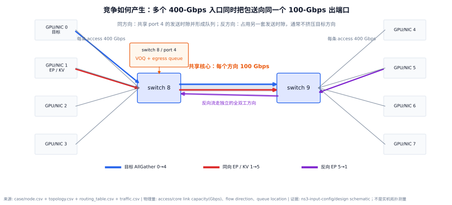
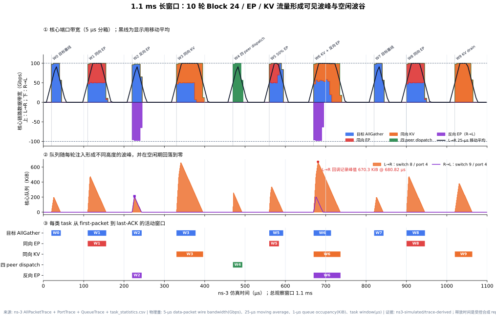

# 长时间网络竞争与流量波形报告

日期：2026-09-30  
结论先行：网络竞争不是“同时有很多流”这一抽象描述，而是多个流在同一时刻申请同一个受限出端口的发送时隙。本实验中，多个 400 Gbps host access 入口汇入 switch 8 / port 4 的 100 Gbps 核心方向；同向流共享这 100 Gbps 并形成队列，反向流走全双工的另一方向。新增的 1.1 ms 实验用 10 轮实际 ns-3 任务产生了清晰的带宽波峰、空闲波谷和队列起伏。

## 1. 网络场景如何体现竞争

**图 1：竞争发生在共享核心出端口，而不是笼统发生在“网络里”。**

- 数据来源：`experiments/node.csv`、`topology.csv`、`routing_table.csv` 和 `traffic.csv`。
- 物理量与单位：host access 和 core capacity（Gbps）、flow direction、queue location。
- 证据类型：`ns3-input-config/design-schematic`。
- 不能证明：这是已注册的代表性拓扑，不是生产集群或华为超节点的实测拓扑。

竞争由四层关系共同构成：

1. **路径重合。** 目标 AllGather `0→4` 与同向 EP/KV `1→5` 都经过 `switch 8 → switch 9`。
2. **出口共享。** 两条流在 switch 8 都必须经过 `port 4` 的 L→R 发送方向。
3. **注入大于排出。** 每条 access link 为 400 Gbps，而共享 core 只有 100 Gbps；并发入口能比核心更快地把包压入 VOQ/egress queue。
4. **全双工方向隔离。** 反向 EP `5→1` 使用 switch 9 / port 4 的 R→L 方向，不消耗 L→R 的发送时隙，因此目标流基本保持基线水平。

因此，我们用三类观测量证明竞争确实发生：逐包序列化显示不同 task 交替占用同一端口；带宽显示同一方向总和受 100 Gbps 限制；QueueTrace 显示入口注入超过出口服务时队列上升。

## 2. 长窗口实验设计

拓扑、路由、传输投影和 packet trace 口径与上一轮一致，只把工作负载从单次 70 µs 切片扩展为 10 个 release waves。payload 继续复用 Block 24 的 278,528 B 目标流、139,264/278,528 B EP 流、524,288 B KV proxy 和 4×69,632 B dispatch。

| Wave | 释放时间 | 场景 | L→R payload | R→L payload | wave 完成时间 | 目标 FCT |
|---|---:|---|---:|---:|---:|---:|
| W0 | 20 µs | 目标基线 | 278,528 B | 0 | 43.232 µs | 23.231 µs |
| W1 | 110 µs | 同向 EP | 557,056 B | 0 | 155.938 µs | 45.937 µs |
| W2 | 220 µs | 反向 EP | 278,528 B | 278,528 B | 243.732 µs | 23.731 µs |
| W3 | 330 µs | 同向 KV | 802,816 B | 0 | 396.013 µs | 47.312 µs |
| W4 | 470 µs | 四 peer dispatch | 278,528 B | 0 | 493.232 µs | — |
| W5 | 560 µs | 50% EP | 417,792 B | 0 | 594.610 µs | 34.609 µs |
| W6 | 670 µs | KV + 反向 EP | 802,816 B | 278,528 B | 736.602 µs | 43.111 µs |
| W7 | 820 µs | 目标基线 | 278,528 B | 0 | 843.232 µs | 23.231 µs |
| W8 | 900 µs | 同向 EP | 557,056 B | 0 | 945.938 µs | 45.937 µs |
| W9 | 1020 µs | KV drain | 524,288 B | 0 | 1063.277 µs | — |

这里的 release schedule 是为了观察波峰波谷而设计的受控合成 replay，并不是 LLMServingSim 直接导出的生产请求到达序列。W0/W1/W2 等孤立单波形与前一轮结果一致；跨 wave 数字主要用于长时间观测，不替代严格单变量因果实验。

## 3. 长时间网络传输图

**图 2：1.1 ms 内 10 轮网络流量的带宽、队列和 task 活动窗口。** 上图为核心链路两个方向的 data-packet wire bandwidth；中图为两个核心出端口的 `VOQ + egress` queue；下图对齐不同通信类型从 first-packet 到 last-ACK 的时间窗口。

- 数据来源：ns-3 `AllPacketTrace`、`PortTrace`、`QueueTrace` 和 `task_statistics.csv`，汇总为 `analysis/long_window_*.csv`。
- 物理量与单位：5-µs bin wire bandwidth（Gbps）、25-µs L→R 移动平均（Gbps）、1-µs queue occupancy（KiB）、task window（µs）。
- 证据类型：`ns3-simulated/trace-derived`。
- 不能证明：不含 ACK/control 小包带宽；黑线是显示用移动平均；流量到达模式不是生产 trace；链路速率未经真实硬件校准。

## 4. 主要发现

1. **波峰对应通信 wave，波谷对应计算或请求间空档的网络空闲窗口。** 5-µs 原始带宽在活跃期接近 100 Gbps；25-µs 移动平均把短突发组织成更清楚的波形。
2. **同向竞争延长波峰宽度，而不是突破链路容量。** W1 的两个 278,528-B 流共享同一个 L→R 方向，目标 FCT 从 23.231 µs 增至 45.937 µs；每个 5-µs bin 的方向总带宽仍不超过 100 Gbps。
3. **反向竞争形成负向波峰。** W2 同时出现约 `+100/-100 Gbps`，目标 FCT 只有 23.731 µs，说明两个全双工方向各自工作。
4. **队列峰高反映瞬时注入强度和同向总字节。** L→R 原始队列峰值为 670.3 KiB，发生在 W6 的 680.745 µs；R→L 峰值为 208.4 KiB。
5. **长窗口图适合观察时序，孤立 case 适合回答因果。** 本图说明“何时忙、何时空、哪个类型在占用”；要量化某一变量的影响，仍应引用上一轮固定其余条件的方向、字节比和热点实验。

## 5. 当前最细粒度

本轮公开图按 5 µs 展示带宽、按 1 µs 展示队列，但底层分析仍保留 1,302 个 data packet 的精确端口 egress 和序列化区间。也就是说，图是为了长窗口可读性主动聚合，不是仿真只能到微秒级；单个 4,174-B 满包在 100 Gbps core 上仍对应 333.92 ns 的发送区间。
