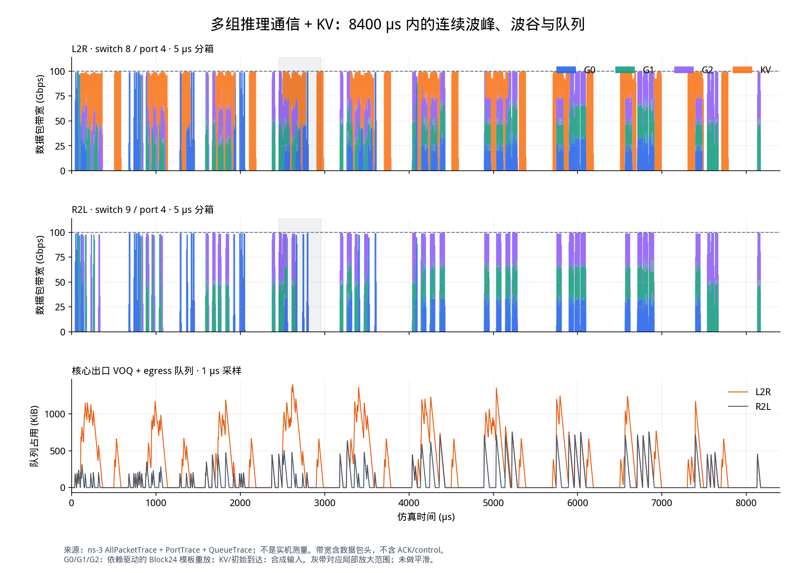
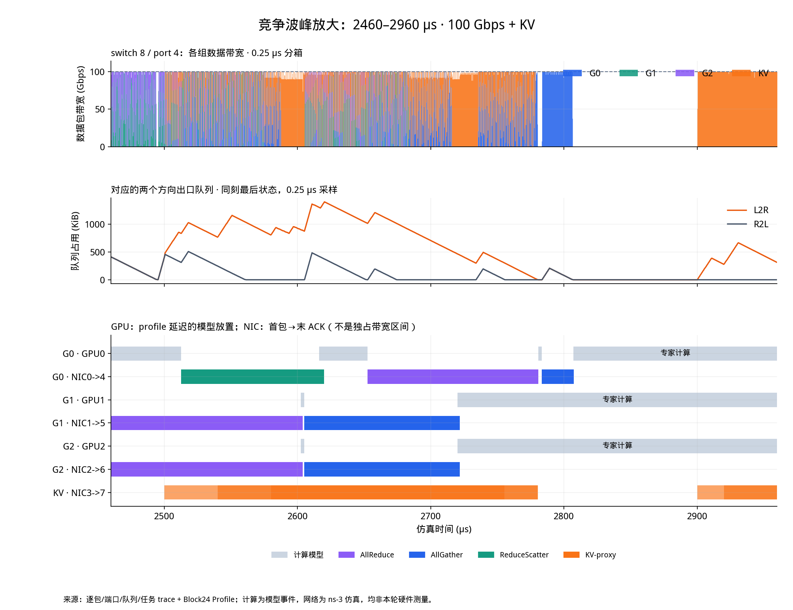
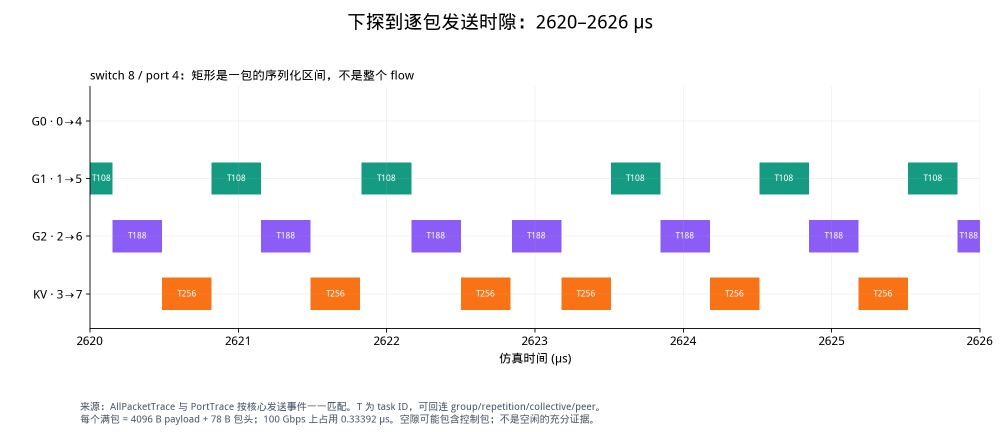
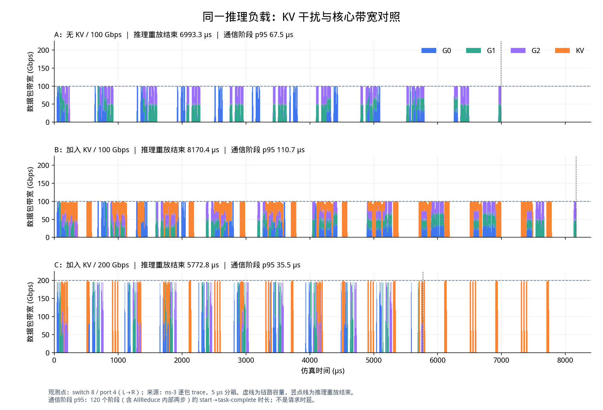

# 多组依赖驱动推理通信与 KV 竞争实验
日期：2026-10-08（北京时间）

## 结论

新跑完 3 个 ns-3-UB 场景，共 820 个任务、59,600 个数据包。流量图覆盖 0–8400 µs，具有多轮波峰、波谷和峰内竞争；另提供 500 µs 局部图和 6 µs 逐包图。

| 场景 | 推理重放结束 / µs | 通信阶段 p95 / µs | L→R 队列峰值 / KiB |
|---|---:|---:|---:|
| A：100 Gbps，无 KV | 6993.333 | 67.519 | 755.221 |
| B：100 Gbps，加入 KV | 8170.354 | 110.738 | 1401.248 |
| C：200 Gbps，加入 KV | 5772.839 | 35.486 | 711.285 |

加入 KV 后，推理重放结束推迟 **16.83%**，阶段 p95 增加 **64.01%**。在同一 KV 负载下，核心带宽翻倍使推理重放结束提前 **29.34%**，不是时间减半：每组仍有 4956.16 µs 固定计算延迟，并且竞争改变了后续通信的重叠关系。

“结束”指三组模板重放最后一个推理任务的完成时间，不是请求 TTFT/TPOT，也不包含后台 KV 必须全部结束的要求。“阶段 p95”对每个场景 120 个推理通信阶段统计 start→task-complete 时长，含 AllReduce 内部两步；它不是 120 次完整 collective 或请求时延。队列峰值取同一时间戳最后一条 VOQ+egress 状态，非硬件 buffer 计数器。

## 1. 场景为什么比之前复杂

- 8 个逻辑 GPU/NIC 节点，0–3 接 switch8，4–7 接 switch9。接入 400 Gbps/20 ns；共享核心链路每方向 100 或 200 Gbps/50 ns。
- G0=(0,4)、G1=(1,5)、G2=(2,6)，初始到达为 0/40/80 µs。它们是三组独立合成副本，不是一个六卡 collective。
- 每组重复 10 次 **同一个零起编号 Block24 模板**（顺序第25层），不是新跑了10个真实层、请求、batch或decode token。
- 每次：注意力计算36.330 µs → AR的RS步 → AR的AG步 → LN2.549 µs → MoE dispatch AG → 专家计算456.737 µs → combine RS。
- 上一阶段双向任务全部完成，再加20 ns可见性延迟和下一段计算延迟，才释放下一阶段。因此拥塞会推迟后续峰的位置，而不只是把预设矩形拉宽。
- KV代理为3→7，每次524288 B；在800k+[100,140,180,500,520] µs释放，k=0..9。该50次到达序列是合成压力输入，不是实测KV流。
- 采用URMA_WRITE/RTP、priority7、CBFC；CC和重传关闭，最短路径HASH、无多路径/喷包。host与switch输入处理10 ns，仲裁1 ns。
- A→B只改变KV是否存在；B→C只改变核心带宽。实际输入逐字节/逐单元验证，没有同时修改计算、流量或接入参数。

## 2. 长时间波形

来源：新运行的 AllPacketTrace、PortTrace、QueueTrace。观测点为 switch8/port4 的 L→R 和 switch9/port4 的 R→L。前两图物理量是每5 µs的**数据包线速带宽（Gbps）**，包括观察到的78 B包头，不含ACK/control；第三图是每1 µs采样的队列状态（KiB）。没有平滑滤波；波谷只表示所选方向没有数据包占用，不能据此断言全网空闲。

与旧图不同，推理通信起点由完成依赖推进；但副本初始到达与KV释放仍是人为输入。GPU计算由已有Profile时长建模，不是本轮GPU实测。

## 3. 波峰里的计算与通信

选择规则：在1000–6000 µs中寻找L→R队列的最大稳定状态，截取2460–2960 µs。它是**拥塞诊断切片**，不代表平均或随机抽样的典型情况，也不能外推生产请求分布。

上图：switch8/port4，各组0.25 µs数据带宽（Gbps）；中图：两方向0.25 µs队列（KiB）；下图：GPU0/1/2计算模型事件，与NIC0→4/1→5/2→6及KV3→7的首包→末ACK活动窗。GPU4/5/6按同一双向屏障模板执行，完整事件CSV也保存这三张卡。

NIC矩形不是独占带宽区间，矩形重叠也不表示每条流各占100 Gbps。任务完成、最后ACK和下一段计算是不同时间点；本实验的依赖使用task-complete，而不是等待所有ACK。该完成语义已经通过canonical事件与阶段起点核对，不能冒称真实CCL/GPU完成语义。

## 4. 下探到单个数据包

来源：AllPacketTrace中逐包核心出口时间（打印到ns），与精度更高的PortTrace发送事件一一匹配。观测点为switch8/port4；横轴为仿真时间µs，矩形宽度为**该包的链路序列化时长**。

- T108：G1第4次模板重放，dispatch AllGather，1→5，278528 B；首包2605.11434 µs，末ACK2721.82572 µs，FCT116.71138 µs。
- T188：G2第4次模板重放，dispatch AllGather，2→6，同样278528 B、FCT116.71138 µs。
- T256：KV代理3→7，524288 B；首包2540.01000 µs，末ACK2780.17068 µs，FCT240.16068 µs。

2620–2626 µs里这三条流交替获得同一个出口的发送时隙。每个满包4096 B payload+78 B包头，在100 Gbps上持续0.33392 µs（333.92 ns）。矩形间的小空隙可能有控制包，不等于端口空闲。当前最细可追溯粒度是**仿真中的包、逐跳时间和端口序列化**，不是实机NIC计数器或真实NCCL channel/chunk。

## 5. 对照结果

三行都观察switch8/port4的L→R数据带宽（5 µs分箱、Gbps）；横轴µs，纵轴使用同一尺度。虚线是容量，竖点线是推理重放结束。C在约5773 µs后仍有橙色峰，是预先安排的后台KV，并不表示推理还未结束。

预注册两条预测均得到支持：KV增加推理结束时间和阶段p95；核心提速降低这两个指标。三个case分类为matched，逐指标绝对差和百分比保存在comparisons.csv。这里只验证受控场景，不构成真实集群校准或优化建议的充分证据。

## 6. Trace的生成链和证据边界

LLMServingSim原有Block24类型/字节及Profile时长 → 显式双rank ring投影 → 带phase依赖的traffic.csv → ns-3运行 → task/packet/port/queue trace → 统一事件流与图。

源数据：本目录sources/flow_manifest.csv与llmservingsim_middle_block_events.csv；原路径与SHA256见sources/source_manifest.csv。仅复用类型、字节和计算时长，**没有复用旧重建通信时间戳**。原Profile来自RTX PRO 6000 Blackwell Server Edition，dummy weights/eager，单GPU模拟TP分片形状；不是A100真机、更不是多机IB/RoCE复验。本轮没有重跑LLMServingSim请求调度器，没有新增真实token路由或线上双向联合调度。

每个case的flow_manifest保留group→repetition→source_block24→collective→phase→task→src/dst→bytes；analysis下的packets进一步连接UID/PSN与端口时间。events.csv统一计算模型事件和网络通信活动窗。

## 7. 验证与复现

三个case返回码均为0：A=240任务/15600数据包，B=C=290任务/22000数据包。核对每task payload、packet↔port一一映射、包含控制包的端口序列化不重叠、分箱积分守恒、阶段依赖、canonical START/COMPLETE_VISIBLE与全时间窗覆盖。8项分析测试通过，包含固定条件和三组真实输出检查。

最初约8000 µs的展示窗口不足以覆盖B的8170.481 µs末ACK，因此扩为8400 µs；未截断运行或调整负载。分析首版遇到Type:PKT中的1 B协议小消息，已明确排除并用每task完整payload守恒约束分类，未修改原始trace。

本轮使用OpenUSim规划/运行/分析技能固定实验矩阵、保留预测和执行日志；按visualize的科研图指导直接从trace作图。没有修改simulator core或覆盖历史实验。

- 计划与原始结果：ns-3仓库scratch/20261008-dependent-moe-kv-contention/。
- 重新分析：在本目录执行 `python3 tools/analyze.py`、`python3 tools/plot.py`。
- 回归：`python3 -m unittest discover -s tools -p 'test_*.py' -v`。
- 全新复验：先使用新的包目录，检查脚本路径与矩阵；生成/运行脚本拒绝覆盖旧traffic或runlog。公开数据快照可用于只读复核，完整原始trace仍保存在本地case目录。
- 下一步：校准“何时通知GPU通信完成”的语义，并采集目标硬件的计算与CCL trace；否则当前延迟和波形仍只能用于机制研究。
