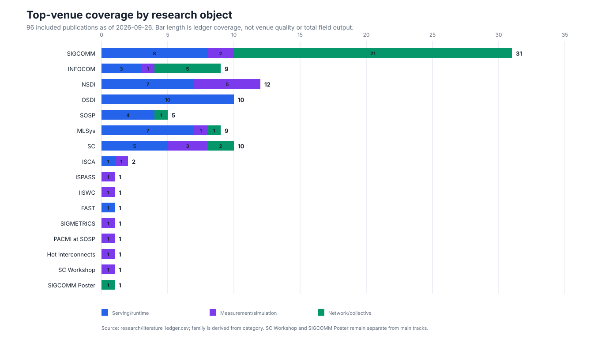

AIDC 推理测量、仿真与传输长尾
==================================

本页将 96 项顶会论文、四卡 A100 校准、SimAI/LLMServingSim 实验和 Block 24
逐包闭环放进同一证据框架。完整可下载/评审版本为
:download:`Markdown 主报告 <../research/aidc-inference-tail-survey.md>`，逐篇字段见
:download:`文献账本 CSV <../research/literature_ledger.csv>`，检索范围、关键词和排除规则见
:download:`检索协议 <../research/search-protocol.md>`。

结论
----

* 单纯将 LLMServingSim 或 SimAI 接到 ns-3 已不足以构成创新；ASTRA-sim、SimAI、Arcadia、
  Wormhole、DistriAI 等已经覆盖类似平台或后端。
* 真正缺口是 request/layer/expert/collective 语义和 flow/packet/queue 长尾之间的归属闭环，
  以及不同保真度怎样给出 P95/P99 和不确定性。
* 本地 A100 replay 表明总 bytes 不能充分预测 A2A：中度热点可能比极端 Zipf 更慢，必须保留
  完整 ``src-dst`` 矩阵、方向、非零 peer 数和 runtime 调度。
* 当前最小闭环已能把同一 Block 24 从 520.639 μs 的 block 下钻到 10 ns 的 switch dwell；
  下一缺口是真实 NCCL channel/peer/timestamp 和生产 fabric 校准。

文献分类
--------

   **会议覆盖不是简单凑数量。** 主会包括 SIGCOMM 31、INFOCOM 9、NSDI 12、OSDI 10、
   SOSP 5、MLSys 9、SC 10 和 ISCA 2 项；workshop/poster 明确单列。

:数据来源: ``research/literature_ledger.csv``，由 ``tools/build_literature_figures.py`` 确定性生成。
:物理量与单位: 横轴和段内数字均为纳入账本的论文数量（篇）；颜色区分推理服务/运行时、测量/仿真和网络/collective。
:证据边界: 数量表示本课题检索覆盖，不表示会议质量或会议全部产出；统计截止 2026-09-26。

.. list-table:: 96 项工作形成的五类版图
   :header-rows: 1
   :widths: 20 39 41

   * - 类别
     - 代表工作
     - 本课题仍缺的能力
   * - 服务调度与内存
     - Orca、vLLM、DistServe、Sarathi、SOLA、JITServe、NanoFlow、Hetis
     - collective/flow/queue 对 request 尾部的因果归属
   * - KV 与推理网络
     - CacheGen、HACK、ARK、KVServe、DualPath、Turbo、GIGANETS
     - MoE EP 动态矩阵与同步长尾
   * - 仿真与 workload
     - SimAI、LLMServingSim 2.0、Vidur、Frontier、Calculon、Wormhole、Arcadia、ServeGen
     - runtime flow 真值、跨保真尾部校准和不确定性
   * - collective/EP 优化
     - SGLB、COMET、UBEP、EPIC、Odin、PReCCL、Theseus、OptCCL、hZCCL
     - 从 request/expert 风险到 SLO 目标的接口
   * - 网络测量与诊断
     - LLM-Pilot、Mycroft、R-Pingmesh、Hawkeye、RDMATracer、Anytest、INSERT、Weir
     - 与 layer、collective、expert、request 的稳定 correlation

INFOCOM 除 RDMA telemetry、RNIC cache、packet scheduling 和 distributed emulation 外，已有
Mell、Online Context Caching 和 serverless MoE deployment 等直接推理工作。MLSys 已覆盖 SiDA、
SOLA、ThunderServe、Seesaw、FlashInfer 和 COMET；SC 已覆盖 LLM-Pilot、PipeInfer、Hetis、
gLLM、Diff-MoE 和 resilience measurement。故不能再把创新描述为一般 serving scheduler、
MoE overlap、inference benchmark 或“有网络后端的仿真器”。

本地实验与代表性
----------------

.. list-table:: 已完成实验
   :header-rows: 1
   :widths: 18 38 24 20

   * - 层次
     - 结果
     - 能证明
     - 不能证明
   * - 四卡 A100
     - 512 KiB/2 MiB/4 MiB 为 87.1/267.2/511.1 μs；4 MiB 标准差 61.3 μs
     - 单机 SHM 的真实均值、波动和固定项
     - EP=320 跨节点绝对性能
   * - SimAI
     - 9,216 GPU workload 的 exposed communication 占 35.21%
     - 大规模并行域筛选
     - packet queue 或生产测量
   * - LLMServingSim
     - dense/MoE 最小 case、EP=320 analytical 和中间 Block 24
     - request→layer→collective 语义
     - NCCL runtime peer/channel 真值
   * - ns-3 Block 24
     - 8/8 task、四个 phase、68-packet selected flow
     - 同 collective 下的 task/packet/hop/queue 粒度
     - A100/生产 fabric 实测

代表性中间切片
--------------

48 个重复 block 中选择 Block 24，是因为它位于中部、避开首尾边界，同时包含 attention、
AllReduce、MoE AllGather、rank-local expert 和 ReduceScatter。选择依据在运行前由位置和结构
决定，不是看到结果后挑选快慢样本。

.. figure:: _static/study/block24-unified-timeline.svg
   :alt: Block 24 在 GPU0 NIC0 GPU1 NIC1 上的计算和网络共轴时间线
   :align: center
   :class: study-figure

   **计算与网络共轴。** GPU0 ``expert_297`` 与 GPU1 ``expert_299`` 各运行 456.737 μs；
   NIC lane 显示同一组 AllReduce、AllGather、ReduceScatter 的 rank-pair task。

:数据来源: ``block24_unified_events.csv``；GPU duration 来自 LLMServingSim profile，NIC start/complete 来自 ns-3 TaskTrace。
:物理量与单位: 横轴为相对 Block 24 起点的时间（μs），条宽为 operation/WQE duration（μs）。
:证据边界: GPU 为 ``profile-derived``，flow 为 ``algorithm-projected``，NIC 时间为 ``ns3-simulated``；未建模真实 GPU/NIC overlap。

.. figure:: _static/study/block24-flow-profile.svg
   :alt: Block 24 八条 flow 的方向 payload WQE FCT 和 ACK envelope
   :align: center
   :class: study-figure

   **谁到谁、耗时多少。** 每个 phase 中 0→1 和 1→0 并行；WQE FCT 为
   6.126–6.527 μs，packet/ACK envelope 为 6.180–6.579 μs。

:数据来源: ``block24_task_profile.csv``，由 flow manifest 与 ns-3 task statistics 按 ``task_id`` 连接。
:物理量与单位: flow duration（μs）与 payload（KiB）；柱和点分别使用两种完成口径。
:证据边界: 两个方向不能相加；WQE completion 和 last ACK 不是同一事件。

.. figure:: _static/study/block24-task4-packet-hops.svg
   :alt: Task 4 六十八个数据包的逐跳延迟和完成里程碑
   :align: center
   :class: study-figure

   **逐包下钻。** task 4 是 0→1 的 278,528 B AllGather flow，包含 68 个 4 KiB 数据包；
   两段链路各约 103–104 ns，switch dwell 为 10–518 ns。

:数据来源: ``block24_packet_profile.csv``、AllPacketTrace、QueueTrace 和 task parser。
:物理量与单位: hop/dwell 为 ns，task milestone 为 μs，queue occupancy 为 B。
:证据边界: 全部为当前 400 Gbps 单交换机配置的 ``ns3-simulated`` 值，不是硬件 counter。

关键发现
--------

1. peer=1/3 的本地拟合分别是 ``30.6 + 68.2×MB`` 和 ``42.1 + 116.1×MB`` μs；
   只有两个 peer 点，不能外推 319 peers。
2. replay 内嵌 A2A 比裸微基准慢约 30%–60%，Dispatch 另有约 285 μs pack 和
   120–145 μs count 交换，说明 endpoint 与同步开销不能塞进单一带宽项。
3. 中度热点可能比极端倾斜更慢；总 bytes、最大 peer bytes 和单调 skew factor 都不足。
4. 包级 trace 将稳定的 103–104 ns link delay 与 10–518 ns switch dwell 分开，证明
   representative slice 的逐包下钻可以定位 queueing 展宽。

三项创新工作
------------

.. list-table:: 共享 event schema 的研究主线
   :header-rows: 1
   :widths: 20 30 30 20

   * - 工作
     - 核心假设
     - 关键 baseline
     - 可证伪条件
   * - A：跨层可观测与根因诊断
     - 语义 correlation 能区分 endpoint、GPU、fabric queue 与同步等待
     - Hawkeye、RDMATracer、Taking the Pulse、PReCCL
     - 不优于 endpoint-only/network-only 或开销不可接受
   * - B：多保真 MoE 长尾仿真
     - 完整矩阵 + runtime 调度 + 触发式逐包下钻可预测 P95/P99
     - SimAI、LLMServingSim、Frontier、m3、ns-3、Wormhole
     - 矩阵信息无增益，或下钻不能改善尾部预测
   * - C：P99/SLO 风险控制
     - risk-aware collective 目标比 mean/bytes-only 提高 SLO goodput
     - SGLB、Odin、Theseus、EPIC、UBEP
     - 只损失平均吞吐而不改善 SLO goodput

最优先的可拆分科学问题是：构建 routing-skew × message-size × peer-count phase diagram，验证
“中度倾斜最差”是否能在 runtime channel trace 中重现；随后用三源观测区分 endpoint、GPU 同步
和 fabric queue，再用误差/不确定性触发 representative-slice 的逐包下钻。SOLA、JITServe、
FastServe 已经覆盖 SLO/抢占调度，因此工作 C 必须证明新的 collective P99/CVaR 风险信号确实
提高端到端 SLO goodput，而不是再实现一个通用调度器。

与 SIGCOMM 2026 的边界必须写清：UBEP/EPIC 已覆盖 EP 通信优化，Odin 已覆盖 A2A CC，
PReCCL 已覆盖遥测驱动重分配，Theseus/OptCCL 已覆盖 schedule 切换/合成，Nüwa/Arcadia/
Wormhole 已覆盖平台与加速。因此可主张的差异是 **serving semantic attribution、矩阵感知的
tail uncertainty，以及从 collective risk 到 TTFT/TPOT/SLO 的闭环**。

下一步
------

1. 在 8 GPU 固定 collective 上同步采集 NVTX、NCCL peer/channel 和 NIC 计数；
2. 构造相同总 bytes 但方向/稀疏度不同的 20–30 个矩阵，每点重复至少 100 次；
3. analytical/flow 模型只对高误差或高不确定性的 slice 触发 packet simulation；
4. 用 BurstGPT/ServeGen 请求流验证 collective P99 是否真正传递到 TPOT/SLO goodput；
5. 预注册失败条件，避免只选择支持“中度倾斜最差”的案例。
