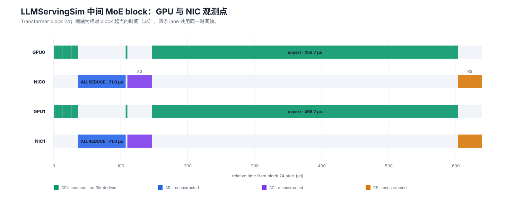

2026-09-26：代表性复核与中间时间切片
=====================================

当日目标
--------

复核现有实验是否具有代表性，并严格解释这项要求：

   “选择有代表性的中间时间点或时间切片，以集合通信为例做详细 profile，观察能够达到的粒度。”

同时将网站重组为“每日研究记录 + 专题报告”，避免每天的修改只存在于提交历史或聊天记录。

为什么选择 transformer block 24
-------------------------------

本次 MoE prefill 含 48 个重复 transformer block。选择 block 24 是因为它位于执行中部：

* 避开 embedding、首层初始化等前部边界；
* 避开最后一层和输出阶段的尾部边界；
* 同时包含 dense attention、collective、两个 rank-local expert 和返回 collective；
* GPU0/GPU1 与 NIC0/NIC1 都有事件，适合检查多观测点对齐。

切片的绝对起点是 15,330.808500 μs，终点是 15,969.464646 μs，总跨度
638.656146 μs。图中将起点归零，使用相对时间避免大绝对时间掩盖微秒级阶段。

   **Block 24 四观测点时间线。** 两个 GPU 执行相同的 attention 路径并分别运行本地
   expert；两个 NIC lane 标出参与同一 collective 的 rank 视角。

:数据来源: ``source/_static/study/data/moe_middle_block.csv``，由 LLMServingSim prefill trace、layer profile 和 request TTFT 对齐生成。
:物理量与单位: 横轴为相对 block 起点的时间（μs）；计算条表示 profile latency，通信条表示重建的 collective phase duration。
:证据类型: GPU compute 为 ``profile-derived``；collective 类型和 bytes 为 ``trace-derived``；collective start/end 为 ``reconstructed``。
:解释边界: NIC0/NIC1 两条 lane 是同一 collective 的两个参与者视角，不能把两条 duration 相加；重建时间不是网络实测。

切片内到底能看到多细
--------------------

.. list-table:: Block 24 事件序列
   :header-rows: 1
   :widths: 18 18 24 17 23

   * - 观测点
     - 操作
     - 相对区间（μs）
     - duration / bytes
     - 证据
   * - GPU0/GPU1
     - LayerNorm
     - 0.000–2.549
     - 2.549 μs
     - profile-derived
   * - GPU0/GPU1
     - QKV projection
     - 2.549–13.322
     - 10.773 μs
     - profile-derived
   * - GPU0/GPU1
     - QK norm
     - 13.322–16.554
     - 3.232 μs
     - profile-derived
   * - GPU0/GPU1
     - Rotary embedding
     - 16.554–18.527
     - 1.973 μs
     - profile-derived
   * - GPU0/GPU1
     - Attention
     - 18.527–26.559
     - 8.032 μs
     - profile-derived
   * - GPU0/GPU1
     - Output projection
     - 26.559–36.330
     - 9.771 μs
     - profile-derived
   * - NIC0/NIC1
     - AllReduce
     - 36.330–107.350
     - 71.020 μs / 524,288 B
     - type/bytes 来自 trace；时间重建
   * - GPU0/GPU1
     - LayerNorm
     - 107.350–109.899
     - 2.549 μs
     - profile-derived
   * - NIC0/NIC1
     - AllGather
     - 109.899–146.409
     - 36.510 μs / 278,528 B
     - type/bytes 来自 trace；时间重建
   * - GPU0 / GPU1
     - expert_297 / expert_299
     - 146.409–603.146
     - 各 456.737 μs，并行
     - profile-derived
   * - NIC0/NIC1
     - ReduceScatter
     - 603.146–638.656
     - 35.510 μs / 524,288 B
     - type/bytes 来自 trace；时间重建

这张切片因此能回答：哪个资源在工作、运行什么操作、操作顺序、持续多久、通信原语是什么、
参数 bytes 是多少，以及每个数字属于哪一种证据。它还能显示 GPU0 的 ``expert_297`` 与
GPU1 的 ``expert_299`` 是并行的，而不是把两次 456.737 μs 串行相加。

粒度阶梯
--------

现有实验覆盖了五级观察粒度，但后两级来自独立 ns-3 case：

.. list-table:: 从服务到包的观察尺度
   :header-rows: 1
   :widths: 20 26 25 29

   * - 粒度
     - 当前实例
     - 时间尺度
     - 能回答的问题
   * - Request
     - MoE TTFT
     - 30.887345 ms
     - 用户何时得到首 token
   * - Block
     - transformer block 24
     - 638.656 μs
     - 计算与通信怎样交替
   * - Layer operation
     - Rotary / expert 等
     - 1.973–456.737 μs
     - 哪个 GPU 跑什么、耗时多少
   * - Rank-pair flow
     - 独立 8-rank AllToAll case
     - 75.741–77.162 μs
     - 谁发给谁、packet envelope 多长
   * - Packet hop
     - 独立 task 0
     - 约 0.1 μs/hop
     - NIC 和交换机各 hook 的时间

严格判断：目前满足了什么，还缺什么
----------------------------------

**已经满足的部分**
   已经选择了执行中部的稳定 block；用 GPU0/NIC0/GPU1/NIC1 四个观测点展开；能看到
   attention、AR、AG、expert、RS 的顺序；能指出计算由哪个 GPU 执行、持续多久，也能指出
   collective 类型和参数 bytes。

**尚未端到端闭合的部分**
   图中的 block 24 来自 LLMServingSim MoE trace，而逐流/逐包 ns-3 图来自另一个独立的
   8-rank 4 MiB AllToAll microcase。实际 block 24 使用 AR/AG/RS，并不是该 AllToAll case。
   因此目前不能声称“图 8--10 的 56 条流就是 block 24 的通信”，也不能给出 block 24
   某个 rank pair 的 ns-3 FCT。

这一区别意味着当前实验已经证明“时间切片能够做到 layer/collective 粒度”和“网络侧能够做到
flow/packet 粒度”，但还没有用同一个 ``collective_id`` 将两者连接起来。此前把两组图放在同一
分析链中是方法展示，不是同一次通信的直接因果证据。

下一步最小闭环实验
------------------

要完整满足原要求，应只补一个小而严格的 case，而不是先扩大规模：

1. 给 block 24 的 AR、AG、RS 分配稳定 ``collective_id``，保留 request/batch/layer/rank group；
2. 从实际 trace 或 runtime instrumentation 得到 collective group、逻辑 bytes 和 launch order；
3. 分别按真实 backend 展开 AR、AG、RS 的 ``src、dst、bytes、dependency``，不能替换成另一个 AllToAll；
4. 将展开后的 flow 送入同一 ns-3 拓扑，记录 ``data_ready``、WQE completion、ACK 和端口路径；
5. 用 ``collective_id → flow_id → task_id → packet`` 关联表合并 GPU/NIC 时间线；
6. 若 start/end 仍来自 residual 重建，继续标为 reconstructed；只有 runtime/profiler 直接时间戳才能标为 measured。

完成后才能对同一个 block 24 准确回答：“这次 AllGather/ReduceScatter 中谁向谁发送、每条流
多少字节、经过哪个端口、耗时多少，以及什么时候解锁后继 GPU 计算。”

当日修改
--------

* 新增 :doc:`index`，建立按日期维护的研究日志入口；
* 新增 2026-09-24 首轮实验记录；
* 首页导航区分每日记录、系统数据、专题研究和边界复现；
* 在专题报告中补充 block 24 与独立 ns-3 AllToAll case 尚未闭环的明确警告；
* 更新 README，固定今后的每日页面维护和发布流程。

