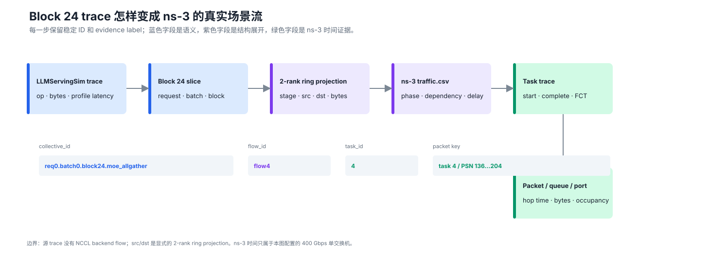
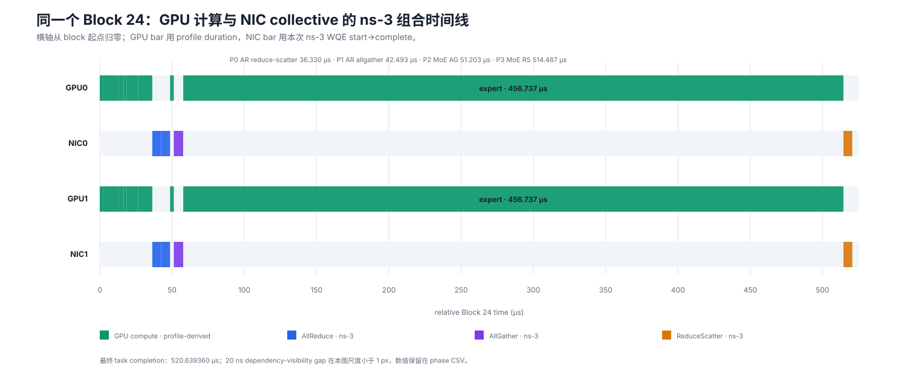
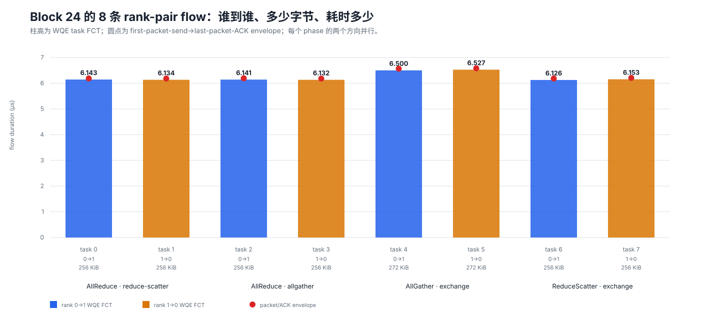
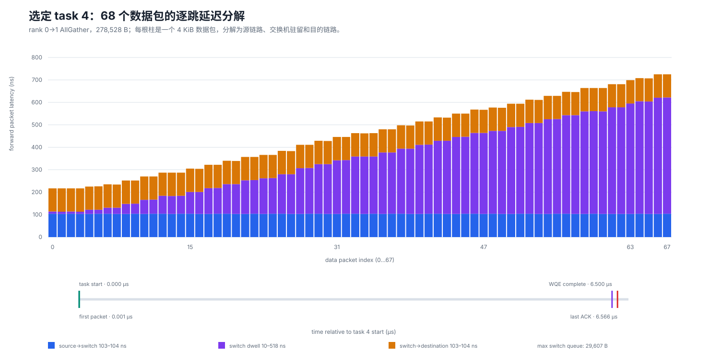
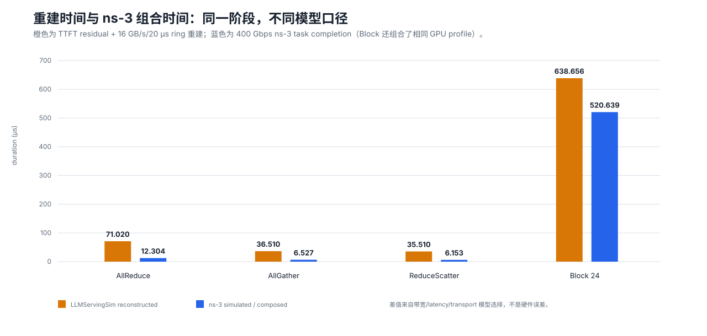

2026-09-26：Block 24 闭环与 AIDC 推理长尾调研
===============================================

当日追加：顶会调研与创新工作
----------------------------

在 Block 24 闭环之后，继续审计了 SIGCOMM、INFOCOM、NSDI、OSDI、SOSP、MLSys 等会议的
55 项工作，并与四卡 A100、SimAI、LLMServingSim、Frontier 和 ns-3 证据逐项对照。结论是：
“再做一个带 ns-3 后端的仿真器”不足以构成创新，真正空白集中在 serving semantic
attribution、完整 ``src-dst`` 矩阵导致的非单调 tail、多保真 P95/P99 不确定性，以及从
collective risk 到 TTFT/TPOT/SLO goodput 的闭环。

本次新增三项共享 event schema 的可证伪工作：跨层可观测与根因诊断、矩阵感知的多保真
MoE 长尾仿真、面向 P99/SLO 的风险感知 collective 控制。完整文献分类、与 SIGCOMM 2026
工作的重复性审计、假设、baseline、指标和失败条件见 :doc:`../aidc-inference-tail-survey`；
可评审 Markdown 原稿和 55 项 CSV 账本保存在仓库 ``research/`` 目录。

当日结论
--------

今天完成了此前缺失的同一 collective 闭环：不是再把 LLMServingSim 的 block 24 和另一个
8-rank AllToAll case 并排展示，而是把 **同一个 request 0 / batch 0 / transformer block 24**
的 AllReduce、AllGather、ReduceScatter 展开为 8 条双向 flow，送入 ns-3-UB，并用稳定 ID
一路关联到 task、packet、switch hop、queue 和 port trace。

最终可以对原要求作严格回答：

   “有代表性的中间时间切片”是 48 个 transformer block 中的 block 24；“详细 profile”
   能从 520.639 μs 的 block 级跨度，下钻到 6–12 μs 的 collective phase、约 6.1–6.5 μs
   的 rank-pair flow、68 个 4 KiB data packet，以及 10–518 ns 的 switch dwell。

.. important:: 证据边界

   LLMServingSim 提供 collective 类型、逻辑 bytes 和 profile-derived GPU latency；两 rank
   ring flow 是显式算法投影，因为源 trace 没有 NCCL backend flow；task/packet/hop/queue/port
   时间是 400 Gbps 单交换机 ns-3 仿真值。它们都不是 A100 或生产网络实测。

一、trace 怎样形成并进入 ns-3
------------------------------

   **同一通信的关联链。** ``collective_id`` 保留模型语义，``flow_id`` 表示算法展开后的
   rank-pair，``task_id`` 是 ns-3 workload 主键，最后可定位到 packet PSN 和端口事件。

:数据来源: LLMServingSim Block 24 event 表、``flow_manifest.csv``、ns-3 ``traffic.csv`` 及 runlog 字段合同。
:测量的物理量: 本图表达数据血缘和关联键，不编码数值物理量，因此无单位。
:证据类型: 方法/接口语义；flow 结构为 ``two-rank-ring-projection``，绿色节点中的时间为 ``ns3-simulated``。
:解释边界: 箭头表示字段变换和关联，不表示已经获得真实 NCCL channel schedule，也不表示模型精度逐级提高。

形成逻辑分为六步：

1. LLMServingSim 文本 trace 直接给出 layer 的 profile lookup latency、collective 类型和逻辑
   bytes，但不提供逐 collective start/end，更不提供 peer flow；
2. 分析器选择 ``transformer_block_24``，保留 request、batch、block、rank 和 GPU/NIC 资源语义；
3. 对 2-rank group 明确采用 ring 投影：AllReduce 拆成 reduce-scatter 和 allgather 两阶段，
   AllGather/ReduceScatter 各拆成两个相反方向的 flow；
4. ``flow_manifest.csv`` 为每条流写入 ``collective_id、algorithm_stage、flow_id、task_id、
   src_rank、dst_rank、bytes、dependency`` 和 evidence source；
5. ``traffic.csv`` 将 flow 映射为 ``URMA_WRITE`` task；``phaseId`` 表达并行阶段，
   ``dependOnPhases`` 表达阶段依赖，compute gap 映射为依赖满足后的 delay；
6. ns-3 输出 WQE task、first-packet/last-ACK、逐包逐跳、queue 和 port trace，再按同一
   ``task_id`` 回连 collective。

``URMA_WRITE`` 只是本次 ns-3 的 transport projection，不是“真实 NCCL 使用 UB URMA”的声明。

二、为什么这个时间切片具有代表性
--------------------------------

本次 MoE prefill 有 48 个重复 transformer block。选择 block 24 有四个具体理由：

* 位于执行中部，避开 embedding、首次初始化和输出尾部边界；
* 同时包含 dense attention、AllReduce、MoE dispatch、rank-local expert 和 ReduceScatter；
* GPU0/GPU1 与 NIC0/NIC1 都有事件，可在同一时间轴核对计算和通信；
* block pattern 在邻近层重复，选择依据是位置和结构，不是先看到网络结果后挑选快慢样本。

它对“观察粒度和打通方法”有代表性，但不代表全部生产流量：本次只有 2 rank、1 个交换机、
1 个 request 和无背景流，不能外推多机多 rail、跨 spine 拥塞或大规模尾时延。

三、实验定义与预注册预测
------------------------

.. list-table:: 单 case 固定配置
   :header-rows: 1
   :widths: 24 36 40

   * - 类别
     - 配置
     - 解释
   * - Topology
     - rank/host 0、1；switch 2
     - 每个 host 一条链路接同一 2-port switch
   * - Link
     - 400 Gbps、20 ns propagation
     - 400 Gbps 即 50 GB/s；不是 A100/NVLink 校准值
   * - Switch
     - 10 ns input processing、1 ns allocation
     - deterministic shortest path，无 multipath/spray
   * - Transport
     - on-demand TP、URMA_WRITE、CBFC
     - retransmission 和 congestion control 关闭
   * - Observability
     - detailed
     - task、packet、hop、port、queue 全部保留
   * - Dependency
     - 20 ns completion visibility
     - 前 phase 全部 task 完成并可见后，再施加 compute delay

预运行时固定的预测是：8/8 task 完成、总 payload 为 2,129,920 B、无 drop、phase 不越过依赖，
task 4 有逐包/逐跳 trace，组合后的 block 结束时间约 517–521 μs。实际结果全部满足；预测没有在
看到输出后修改。

四、计算与网络观测点的统一时间图
--------------------------------

   **四个物理观测点共用一个时间轴。** GPU0/GPU1 的 expert 分支并行；NIC0/NIC1 各显示
   本 rank 发出的 AllReduce 两阶段、MoE AllGather 和 ReduceScatter flow。

:数据来源: ``block24_unified_events.csv``；GPU duration 来自 round-06 LLMServingSim profile，NIC start/complete 来自本次 ns-3 ``TaskTrace``。
:测量的物理量: 横轴为相对 Block 24 起点的仿真/组合时间（μs）；条宽为 operation 或 WQE task duration（μs）。
:证据类型: GPU 为 ``profile-derived``；flow 语义为 ``trace + ring projection``；NIC 时间为 ``ns3-simulated``。
:解释边界: 这是一条保守串行组合时间线；20 ns completion-visibility gap 在图上小于 1 px，但保留在 CSV 中；没有建模真实 GPU/NIC overlap。

关键事件按 task-complete 口径为：

.. list-table:: Block 24 组合阶段
   :header-rows: 1
   :widths: 21 25 19 19 16

   * - 阶段
     - rank-pair payload
     - start（μs）
     - complete（μs）
     - span（μs）
   * - Dense attention compute
     - 每个 GPU 同路径
     - 0.000000
     - 36.330000
     - 36.330000
   * - AllReduce reduce-scatter
     - 双向各 262,144 B
     - 36.330000
     - 42.472840
     - 6.142840
   * - AllReduce allgather
     - 双向各 262,144 B
     - 42.492840
     - 48.633760
     - 6.140920
   * - LayerNorm
     - 每个 GPU 2.549 μs
     - 48.653760
     - 51.202760
     - 2.549000
   * - MoE AllGather
     - 双向各 278,528 B
     - 51.202760
     - 57.729520
     - 6.526760
   * - expert_297 / expert_299
     - 两个 GPU 并行
     - 57.749520
     - 514.486520
     - 456.737000
   * - MoE ReduceScatter
     - 双向各 262,144 B
     - 514.486520
     - 520.639360
     - 6.152840

五、每个 collective 到底是谁发给谁
-----------------------------------

   **8 条 flow 的方向、payload 和两种完成语义。** 每个 phase 中 0→1 与 1→0 同时启动；
   蓝/橙柱是 WQE task FCT，红点是 packet/ACK envelope。

:数据来源: ``block24_task_profile.csv``，由 ``flow_manifest.csv`` 与 ns-3 ``output/task_statistics.csv`` 按 ``task_id`` 连接。
:测量的物理量: 纵轴为 duration（μs）；柱为 WQE start→complete，红点为 first packet send→last packet ACK；标签给出 payload（KiB）和方向。
:证据类型: 方向和 bytes 为 ``trace-derived + algorithmic projection``；两种 duration 为 ``ns3-simulated``。
:解释边界: 两个方向是同一 collective phase 的并行参与者，不能把两根柱相加；FCT 与 ACK envelope 是不同完成口径。

8/8 task 完成。WQE FCT 的最小/中位/平均/最大分别是
6.126120/6.141880/6.231860/6.526760 μs；packet envelope 的对应值是
6.179580/6.188420/6.283675/6.579240 μs。

六、选一个 AllGather flow 下钻到每个 packet hop
--------------------------------------------------

选择 task 4：``collective_id=req0.batch0.block24.moe_allgather``，rank 0→1，278,528 B。
它被分成 68 个 4 KiB data packet 和 5 个 WQE segment。

   **task 4 的逐包逐跳 profile。** 每根堆叠柱是一包的 forward path；下方单独保留 task
   start、first packet、WQE complete 和 last ACK，避免混淆完成语义。

:数据来源: ``block24_packet_profile.csv``，解析 ``AllPacketTrace_PKT_node_0.tr``；queue 最大值来自 ``QueueTrace_node_2_port_1.tr``；完成里程碑来自 task/packet parser。
:测量的物理量: 上图纵轴为单包 forward latency（ns），分成 source→switch、switch dwell、switch→destination；下图为相对 task start 的时间（μs）；queue occupancy 单位为 B。
:证据类型: 全部时间和 occupancy 为当前配置下的 ``ns3-simulated`` trace。
:解释边界: hop timestamp 在 per-hop 文件中以整数 ns 记录；WQE complete 和 last ACK 不是同一事件；queue occupancy 不是硬件 buffer counter。

首包在相对 task start 0.001 μs 发出，经过 104 ns 到 switch ingress、10 ns switch dwell、
103 ns 到 NIC1。68 个包中，两个链路段都稳定在 103–104 ns；switch dwell 却从 10 ns 增长到
518 ns，中位数 255 ns，因此 forward packet latency 从 217 ns 拉长到 725 ns。switch 2 的
destination port 1 在该窗口内最高记录 29,607 B queue occupancy。

task 4 的 WQE complete 是 57.702800 μs，first-packet→last-ACK envelope 结束于
57.769180 μs，二者相差 66.38 ns。这个差异说明报告必须明确“完成”指 WQE、数据到达还是 ACK。

七、最重要的实验发现
--------------------

   **同一阶段在两套时间模型中的差异。** 早期报告中的通信时间来自 TTFT residual 分配；
   本次蓝柱来自实际进入 ns-3 的同一个 Block 24 flow 集合。

:数据来源: ``block24_duration_comparison.csv`` 和 ``block24_summary.json``。
:测量的物理量: collective 和 Block 24 duration（μs）。
:证据类型: 橙柱为 ``reconstructed``；蓝柱为 ``ns3-simulated``，Block 24 蓝柱另组合 ``profile-derived`` compute。
:解释边界: 两组值使用不同 bandwidth、latency 和 transport 模型；差值不能解释为 ns-3 对真实硬件“更准确”。

本次得到五个值得保留的发现：

1. **预注册预测被支持。** 最终 task completion 为 520.639360 μs，落在 517–521 μs 预测区间；
   last-ACK envelope 为 520.692840 μs。
2. **旧的 638.656146 μs 切片主要受通信模型假设影响。** 新组合结果少 118.016786 μs，
   即 18.4789%；原重建使用 16 GB/s 和每步 20 μs latency，本次是 400 Gbps、20 ns 链路。
3. **传播不是 selected flow 的主要变化源。** 两段链路各 103–104 ns，变化集中在 switch
   dwell 的 10–518 ns；packet 级 trace 才能看见这种 queueing 展宽。
4. **依赖语义得到时间戳验证。** phase 1 在 phase 0 最慢 task 完成 20 ns 后启动；phase 2/3
   又分别在依赖可见后等待 2.549/456.737 μs，没有提前越过前驱。
5. **端口平均值依赖观察窗口。** ``throughput.csv`` 将 36.331–520.69 μs 全 active span
   作为分母，包含 456.737 μs expert compute gap，所以端口平均只有 18.17–18.24 Gbps；这不等于
   通信 burst 只利用了 4.5% 的 400 Gbps 链路，更不能据此声明 line-rate efficiency。

八、对原提示词的逐条回答
------------------------

.. list-table:: “中间时间切片详细 profile”怎样被本实验体现
   :header-rows: 1
   :widths: 25 43 32

   * - 原要求
     - 本次具体实现
     - 可以回答的问题
   * - 有代表性的中间时间点/切片
     - 选择 48 层中的 block 24，0–520.639 μs
     - 非边界的 attention→collective→expert→collective 顺序
   * - 集合通信操作为例
     - AR 两阶段、AG、RS 四个 ns-3 phase
     - 每个 collective 的结构、bytes、依赖和 simulated duration
   * - 详细 profile 看粒度
     - block→phase→flow→WQE segment→packet→hop/queue
     - 粒度从数百 μs 下钻到 10 ns
   * - 网络和计算各自时间图
     - GPU0/NIC0/GPU1/NIC1 共轴 lane
     - 哪个 GPU/网卡何时运行、是否并行
   * - 谁到谁、耗时多少
     - 8 条 ``src_rank→dst_rank`` flow 和两种 completion
     - 每个方向的 payload、WQE FCT、ACK envelope
   * - 某一个计算是谁在跑
     - GPU0 ``expert_297``、GPU1 ``expert_299``，各 456.737 μs
     - 两个 expert 是并行，不可串行相加

九、交付、复现与验证
--------------------

原始和分析交付归档在：

``/home/lry/a100_ep_runtime/第07轮_Block24端到端collective_profile_20260926``

其中包括完整 case snapshot、raw runlog、紧凑 CSV/JSON、分析脚本和复现命令。网站提交的精简数据位于
``source/_static/study/data/block24_*``，五张 SVG 由 ``tools/build_block24_figures.py``
确定性生成。

当日验证包括：

* case-file gate：``on-demand`` 模式通过；
* runtime parameter catalog：116 个条目的完整快照，所有 override key 验证通过；
* 数据守恒：8 task、4 phase、2,129,920 B，总方向各 1,064,960 B；
* selected flow：68×4,096 B = 278,528 B；
* 依赖：每个后继 phase start 均不早于前驱 complete + visibility；
* ns-3 parser：8/8 task 都有完整 packet timestamp；
* 页面构建、linkcheck、SVG 确定性重建和 Git diff 检查在提交前执行。

与 2026-09-24 的关系
--------------------

:doc:`2026-09-24` 建立了 SimAI、LLMServingSim、SimCCL 和 ns-3 的分层方法，并用独立
8-rank AllToAll case 证明网络侧能达到 flow/packet 粒度。今天的工作消除了那个证据缺口：
现在 block 24 与逐 flow/packet 图来自同一组 AR/AG/RS，不再把 56 条 AllToAll 流解释成
block 24 的直接通信证据。跨日期的完整方法见 :doc:`../simai-llmservingsim-study`。
