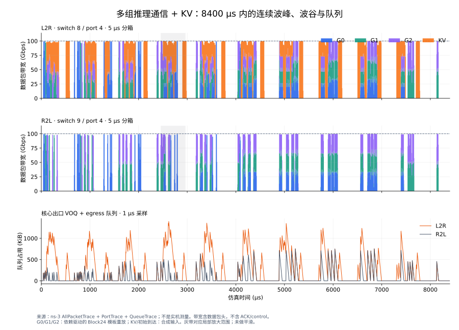
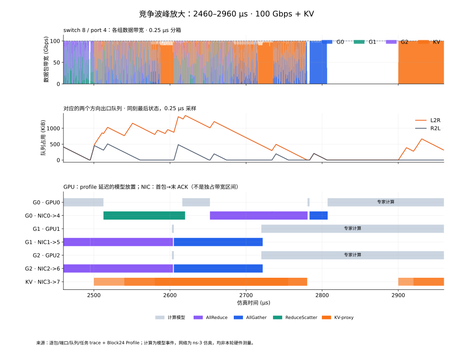
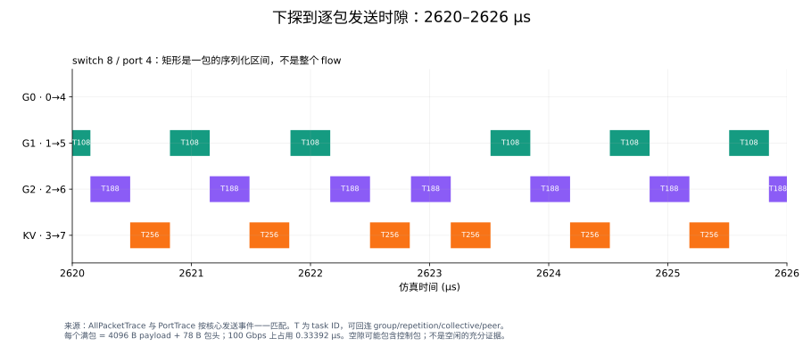
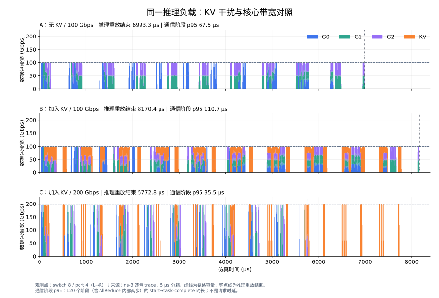

依赖驱动多组推理与 KV 竞争
===========================

本轮新跑完 3 个 ns-3-UB 场景，共 **820 个任务、59,600 个数据包**。
时间轴覆盖 **0–8400 μs**；另提供 500 μs 拥塞切片和 6 μs 逐包图。
没有新增 A100、IB/RoCE 真机测量。

场景与控制变量
--------------

8 个逻辑 GPU/NIC 节点、双交换机：0–3 接 switch8，4–7 接 switch9。
接入链路 400 Gbps/20 ns，核心每方向 100 或 200 Gbps/50 ns。
G0=(0,4)、G1=(1,5)、G2=(2,6) 是三组独立双节点副本，初始到达为 0/40/80 μs。

每组重复 10 次同一个 Block24 模板，**不是 10 个真实请求、batch 或模型层**：

.. code-block:: text

   注意力计算 36.330 μs → AR的RS步 → AR的AG步
   → LN 2.549 μs → dispatch AllGather
   → 专家计算 456.737 μs → combine ReduceScatter → 下一次模板重放

每阶段双向任务完成后，加 20 ns 完成可见性延迟与下一段计算延迟，才释放后继。
网络竞争会改变后续波峰的位置；但这不是在线 LLMServingSim/ns-3 双向联合调度。

后台 KV 代理为 3→7，每次 524288 B，释放时刻为 800k+[100,140,180,500,520] μs，
k=0..9，共50次。两组单变量对照为“是否加入 KV”和“核心 100→200 Gbps”；
推理任务、计算、接入、路由和协议参数不变。使用 priority7、CBFC、RTP、URMA_WRITE，
关闭 CC/重传/多路径/喷包；输入处理10 ns、仲裁1 ns。

长时间波形
----------

   多个波峰、波谷及峰内各组份额；灰带对应局部放大，未做平滑。

:来源: 本轮 AllPacketTrace、PortTrace、QueueTrace。
:观测点: L→R 为 switch8/port4；R→L 为 switch9/port4。
:物理量: 5 μs 分箱的数据包线速带宽（Gbps）、1 μs 采样队列（KiB）。
:边界: 含数据包头、不含 ACK/control；波谷不代表全网空闲；副本到达和 KV 序列是合成输入。

波峰里的计算与通信
------------------

   选择1000–6000 μs中最大稳定L→R队列附近的2460–2960 μs切片；
   属于拥塞诊断选样，不代表生产平均情况或随机样本。

:来源: 包、端口、队列、任务 trace，以及原有 Block24 Profile 时长。
:观测点: 上图 switch8/port4；中图核心两方向；下图 GPU0/1/2 与 NIC0→4、1→5、2→6、3→7。
:物理量: 0.25 μs 带宽（Gbps）、0.25 μs 队列（KiB）、计算/通信活动窗（μs）。
:边界: GPU灰块为Profile延迟的模型放置，不是kernel trace；NIC彩块为首包→末ACK，不是独占带宽。

依赖使用 task-complete 而非全部 ACK 收齐，所以计算模型与 ACK 尾部可能重叠；
不能将其冒称真实 GPU/CCL 重叠。完整 events.csv 也保留 GPU4/5/6 的模型事件。

逐包下探
--------

   每个矩形是一包在核心出口的序列化区间，T为task ID。

:来源: AllPacketTrace 与 PortTrace 核心发送事件一一匹配，保留 UID、PSN、task、phase。
:观测点: switch8/port4，L→R。
:物理量: 横轴时间（μs）、矩形宽度即单包序列化时间（μs）。
:边界: 满包4096 B payload+78 B包头，在100 Gbps上占用0.33392 μs；空隙可能有控制包。

.. list-table:: 切片里的三条流
   :header-rows: 1

   * - task
     - 语义 / peer
     - payload
     - 首包→末ACK FCT
   * - 108
     - G1第4次模板，dispatch AllGather，1→5
     - 278528 B
     - 116.71138 μs
   * - 188
     - G2第4次模板，dispatch AllGather，2→6
     - 278528 B
     - 116.71138 μs
   * - 256
     - KV代理，3→7
     - 524288 B
     - 240.16068 μs

当前最细可追溯粒度是仿真包、逐跳时间和端口时隙，不是真实 NCCL channel/chunk。
flow_manifest → tasks → packets 保留 group/repetition/block/collective/peer 的关联。

受控对照结果
------------

   同一纵轴尺度；虚线为容量，竖点线为推理重放结束。C结束之后仍有预先安排的KV峰。

:来源: 各场景 packet/port trace、task_statistics.csv。
:观测点: switch8/port4，L→R。
:物理量: 5 μs 带宽（Gbps）、推理重放结束（μs）、阶段p95（μs）。
:边界: p95统计120个推理阶段，含AR内部两步；不是请求TTFT/TPOT或完整collective的p95。

.. list-table::
   :header-rows: 1

   * - 场景
     - 推理重放结束 / μs
     - 阶段p95 / μs
     - 稳定队列峰值 / KiB
   * - A：100 Gbps，无KV
     - 6993.333
     - 67.519
     - 755.221
   * - B：100 Gbps，有KV
     - 8170.354
     - 110.738
     - 1401.248
   * - C：200 Gbps，有KV
     - 5772.839
     - 35.486
     - 711.285

加入 KV 后，推理重放结束推迟 **16.83%**，阶段p95增加 **64.01%**。
同一KV负载下，核心翻倍使重放结束提前 **29.34%**，阶段p95降低 **67.96%**。
固定计算仍占每组4956.16 μs，并且竞争改变后续重叠关系，整体时间没有减半。
两条预注册方向预测均matched，但不能据此直接给出生产部署结论。

来源与验证
----------

原模型为Qwen3-30B-A3B-Instruct-2507；复用Block24类型、字节和计算时长，
不复用旧重建通信时间戳。Profile来源为RTX PRO 6000 Blackwell Server Edition，
dummy weights/eager、单GPU模拟TP分片形状；不是A100多机实测。
逻辑AG/RS → 双rank ring → URMA_WRITE是显式投影，不是真实token路由或运行时CCL trace。

三个case均返回0；每task字节、packet/port映射、含控制包的端口序列化区间、
分箱积分、完成依赖和canonical事件均已核对。**8项分析测试通过**，包含实际输入控制条件。
原展示范围约8000 μs，因实际尾部到8170.481 μs扩为8400 μs；未改负载或截断运行。

完整说明、输入、脚本、CSV、SHA256清单在仓库 ``research/round11/``。
原始大体积runlog保留本地case目录，未全部发布。
下一步应校准任务完成、ACK与目标硬件GPU/CCL完成语义。
