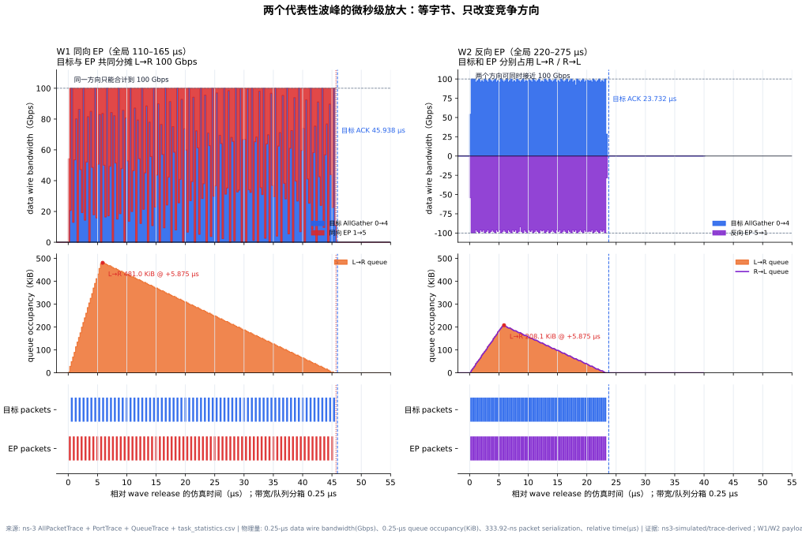

长时间网络竞争与流量波形
========================

本页把 Block 24 的单次微秒级切片扩展到 1.1 ms，回答两个问题：竞争到底发生在网络的
什么位置，以及多轮通信在较长时间轴上会形成怎样的带宽波峰、空闲波谷和队列起伏。

一、竞争发生在哪里
------------------

.. figure:: _static/round10/shared-bottleneck-contention-topology.svg
   :alt: 两交换机共享核心链路中的同向与反向竞争
   :align: center
   :class: study-figure

   **图 1：多个 400-Gbps access 入口共同指向 100-Gbps 核心出端口。** 目标
   AllGather 和同向 EP/KV 共享 switch 8 / port 4 的 L→R 发送时隙；反向 EP 使用
   switch 9 / port 4 的 R→L 方向。

:数据来源: ``research/round10/experiments/node.csv``、``topology.csv``、``routing_table.csv`` 和 ``traffic.csv``。
:物理量与单位: access/core capacity（Gbps）、flow direction、queue location。
:证据类型: ``ns3-input-config/design-schematic``。
:解释边界: 代表性受控拓扑，不是生产集群或华为超节点的实测拓扑。

网络竞争需要同时满足三点：路径重合、同一方向的出端口共享，以及瞬时注入速率超过出口
服务速率。这里每条 host access 为 400 Gbps，而 core 每个方向只有 100 Gbps；多个
入口同时注入时，包只能在 port 4 交替序列化，多余数据进入 ``VOQ + egress`` queue。
反向流走全双工的另一套发送时隙，因此不会直接消耗 L→R 容量。

二、1.1 ms 长窗口实验
---------------------

实验实际运行了 20 个 ns-3 task，组成 10 个 release waves：目标基线、同向 EP、反向
EP、同向 KV、四 peer dispatch、50% EP、KV+反向 EP，以及重复基线/同向竞争。目标、
EP、KV payload 分别复用 Block 24 的 278,528 B、139,264/278,528 B 和 524,288 B。

.. figure:: _static/round10/long-window-network-traffic-waves.svg
   :alt: 1.1毫秒内十轮Block24 EP KV网络流量的带宽队列和任务窗口
   :align: center
   :class: study-figure

   **图 2：1.1 ms 内 10 轮网络流量的带宽、队列和 task 活动窗口。** 上图为两个
   方向的 data-packet wire bandwidth；中图为核心出端口 queue；下图对齐各通信类型
   从 first-packet 到 last-ACK 的窗口。

:数据来源: ns-3 ``AllPacketTrace``、``PortTrace``、``QueueTrace`` 和 ``task_statistics.csv``；汇总为 ``research/round10/long_window_*.csv``。
:物理量与单位: 5-μs wire bandwidth（Gbps）、25-μs L→R moving average（Gbps）、1-μs queue occupancy（KiB）、task window（μs）。
:证据类型: ``ns3-simulated/trace-derived``。
:解释边界: 不含 ACK/control 小包带宽；黑线是显示用移动平均；release schedule 是受控合成 replay，不是生产流量 trace；链路速率未经硬件校准。

三、两个波峰的微秒级放大
------------------------

   **图 3：W1 同向 EP 与 W2 反向 EP 的放大对照。** 两个 wave 的目标/竞争流均为
   278,528 B，只改变竞争方向；横轴为相对 wave release 的仿真时间（μs），标题同时
   标出全局 110--165 μs 和 220--275 μs 窗口。

:数据来源: ``long_window_packet_events.csv``、``zoom_w1_w2_bandwidth_timeseries.csv``、``zoom_w1_w2_queue_timeseries.csv`` 和 ``long_window_task_windows.csv``。
:物理量与单位: 0.25-μs bin data wire bandwidth（Gbps）、0.25-μs queue occupancy（KiB）、333.92-ns packet serialization、relative time（μs）。
:证据类型: ``ns3-simulated/trace-derived``。
:解释边界: 只统计 data packet；queue 是仿真状态；所选 peak 不是实机流量抓包。

W1 中，目标和 EP 在同一个 L→R 方向逐包交替，合计保持 100 Gbps，目标 ACK 为
45.938 μs；L→R queue 在 release 后 5.875 μs 达到 481.0 KiB。W2 中，两条流分别
使用 L→R/R→L，两个方向可同时接近 100 Gbps，目标 ACK 为 23.732 μs；两个方向的
queue 峰值均约 208.1 KiB。底部逐包条带显示：W1 的每条流隔包获得时隙，W2 的两条流
在各自方向连续发送。

四、图中能读出的结论
--------------------

* 波峰对应网络通信 wave，波谷对应网络空闲区间。5-μs 原始带宽在活跃期接近
  100 Gbps，25-μs 移动平均把短突发组织成更清楚的波形。
* 同向 EP 把目标 FCT 从 23.231 μs 增至 45.937 μs，但每个方向仍严格受
  100 Gbps 容量约束；竞争表现为峰宽增加和队列增长，而不是带宽超过容量。
* 反向 EP 形成负向带宽峰。该 wave 同时达到约 ``+100/-100 Gbps``，目标 FCT
  为 23.731 μs，接近基线。
* 全部 QueueTrace 回调记录峰值为 L→R 670.325 KiB（680.82488 μs）、R→L
  212.099 KiB；按同刻最后状态取峰值则为 670.265/208.369 KiB。前者包含同一时间戳
  内的中间更新，后者用于时间采样曲线；二者都不是实机 buffer counter。
* 图按 5/1 μs 展示带宽/队列以保持长窗口可读性；底层仍保留 1,302 个 packet 的
  精确 egress 和序列化区间，单个 4,174-B 满包占用 333.92 ns。

五、如何使用这些图
------------------

长窗口图适合回答“何时忙、何时空、哪类通信正在占用网络”。若要回答“某个变量造成了
多少性能变化”，仍应使用 :doc:`model-hardware-trace-contention` 中固定其余条件的
方向、竞争字节比和目的端热点实验。全部可复核 CSV、实验输入和报告位于
``research/round10/``。

2026-10-08 复核
---------------

波谷来自人为设置的 release 间隔，不能据此认定为 GPU 计算阶段。黑线为居中移动平均，
边沿会提前或延后，判读发送起止请看原始 packet intervals。

本次重建修复窗口末端多一个 bin、W2 放大图尾段缺少数据，以及局部 queue 峰值误带
全局范围的问题。放大 CSV 现完整覆盖 100--280 μs；``raw_scope_start_us/end_us``
给出峰值计算范围。6 项分析回归测试通过；仿真参数、packet 和 task 完成时间未改变。
详细复核及模型/CCL/384 配置边界见 :doc:`goal-evidence-audit`。
