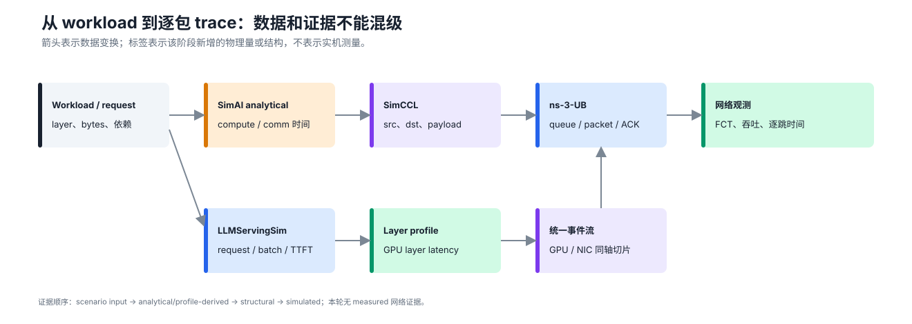
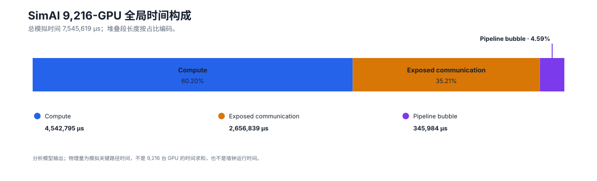
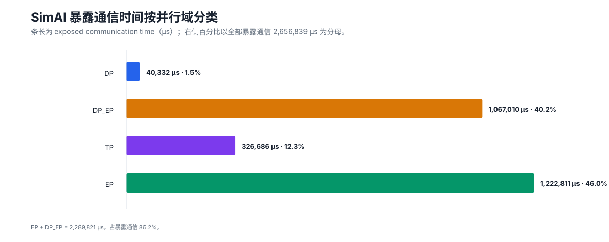
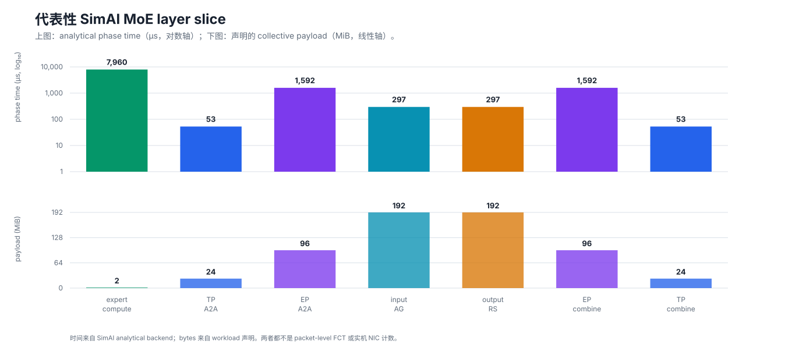
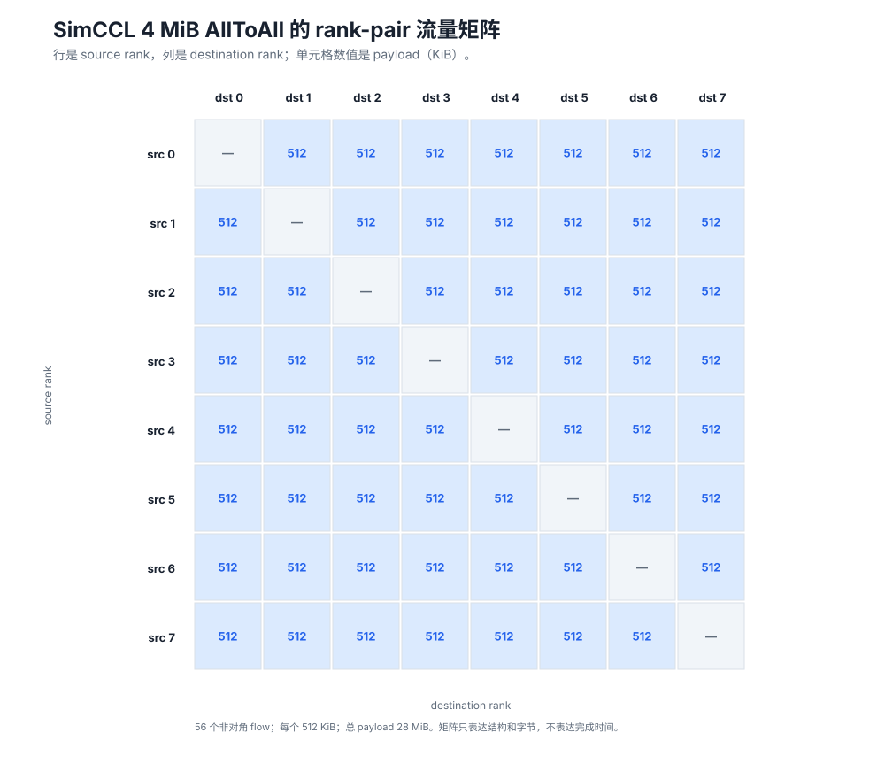
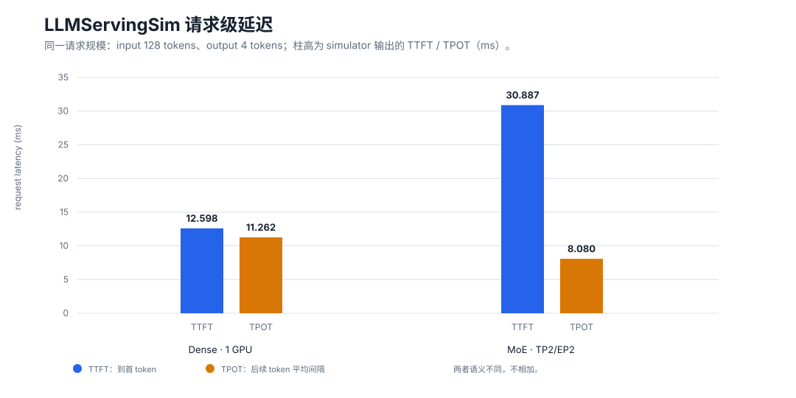
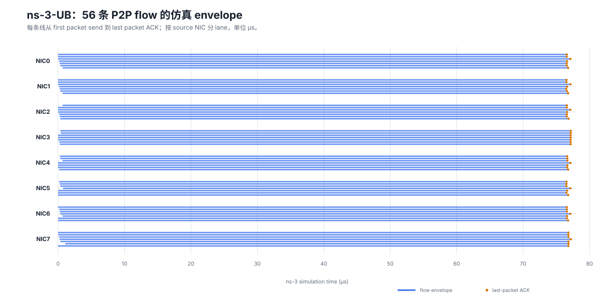
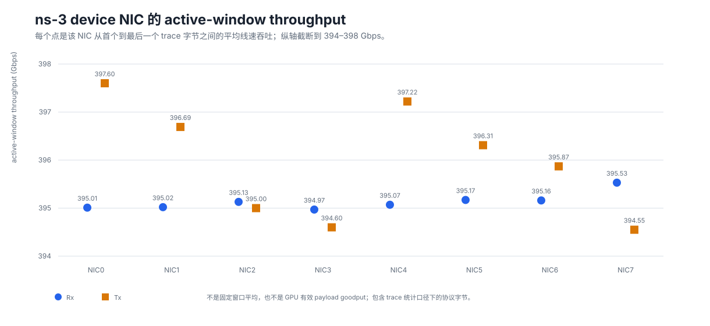
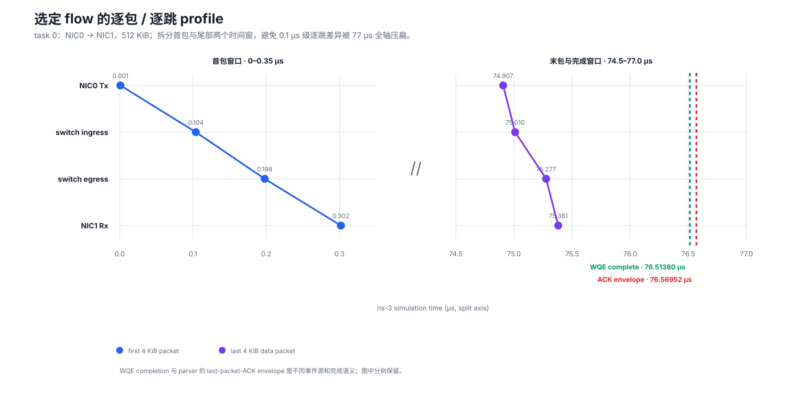
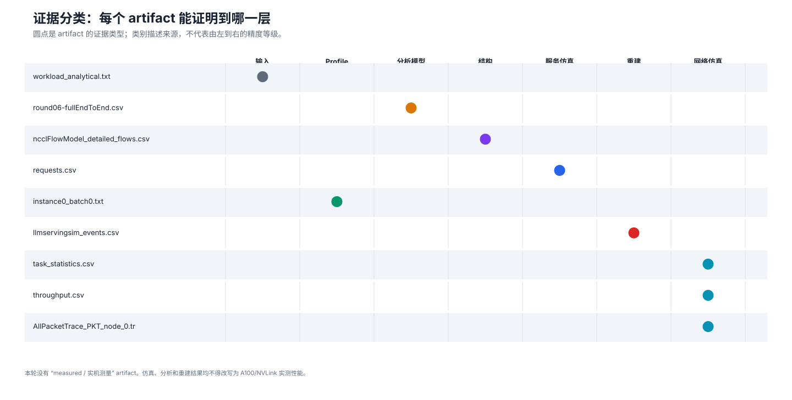

SimAI、LLMServingSim 与 ns-3 实验报告
=======================================

.. meta::
   :description: SimAI 和 LLMServingSim 的优缺点、必要实验、代表性 GPU/NIC 时间切片，以及从 collective 到 ns-3 逐流 trace 的证据分级报告。

本章给出一条可复核的分析链：先用 SimAI 回答大规模并行策略的时间构成，用
LLMServingSim 回答请求级指标和 layer trace，再用 SimCCL 将 collective 展开为
``src → dst`` 流，最后交给 ns-3-UB 得到逐流、逐 NIC 和逐包事件。所有结果按
**输入、Profile、分析模型、结构展开、服务仿真、时间重建、网络仿真** 分类；
本轮没有把任何仿真值写成 A100/NVLink 实机测量值。

结论摘要
--------

* SimAI 9,216-GPU workload 的总模拟时间为 7,545,619 μs：计算 60.20%，暴露通信
  35.21%，流水线气泡 4.59%；暴露通信中 EP 与 DP_EP 合计占 86.2%。
* LLMServingSim 的必要最小实验已跑通：dense 单 GPU 的 TTFT/TPOT 为
  12.598/11.262 ms；2-GPU MoE 的 TTFT/TPOT 为 30.887/8.080 ms。
* MoE 源码 docstring 描述 AllToAll，但本次默认 vLLM backend 的实际 trace 是每层
  ``AllReduce + AllGather + ReduceScatter``。本章以实际 trace 为准。
* 8-rank、4 MiB AllToAll 被 SimCCL 展开为 56 条 512 KiB 流。ns-3-UB 中 56/56
  task 完成，逐流 packet-envelope 中位数为 76.568 μs。
* 中间 block 已整理为 GPU0/NIC0/GPU1/NIC1 共轴事件流；GPU 时间来自 profile，
  collective 类型和字节来自 trace，但 collective 单操作时长是 TTFT residual 按 ring
  权重重建的，只适合 phase 对齐。

一、方法与证据分类
------------------

   **图 1：从场景输入到逐包 trace 的证据链。** 两条分支最终汇入统一的 GPU/NIC
   事件流，但每个阶段保留自己的证据标签。

:数据来源: SimAI workload、LLMServingSim request/layer trace、SimCCL flow model、ns-3-UB task/packet/port trace 的输入输出合同。
:物理量与单位: 本图表达数据血缘和新增字段；不编码数值物理量，因此无单位。
:证据类型: 方法图/接口语义；节点中的 analytical、profile-derived、structural、simulated 是后续数据的类别。
:解释边界: 箭头表示变换关系，不表示精度递增，也不证明模型已经由实机校准。

本报告使用以下口径：

.. list-table:: 证据类别与允许结论
   :header-rows: 1
   :widths: 20 31 49

   * - 类别
     - 典型来源
     - 允许的表述
   * - ``scenario input``
     - workload / request 配置
     - 声明了什么层、并行组、依赖和 bytes；不是运行结果
   * - ``profile-derived``
     - LLMServingSim GPU 性能库
     - 指定模型/shape/profile 路径下的 layer latency
   * - ``analytical``
     - SimAI 或 ring 模型
     - 模型假设下的 compute/comm time；没有 packet queue
   * - ``structural``
     - SimCCL detailed flows
     - peer、payload 和 collective 展开；没有 flow 完成时间
   * - ``simulator output``
     - LLMServingSim ``requests.csv``
     - 当前配置的 TTFT/TPOT/end time；不是硬件测量
   * - ``reconstructed``
     - 本地事件对齐脚本
     - 满足总 TTFT 的一种 phase 时间线；不是原 trace 直接给出的时间戳
   * - ``simulated``
     - ns-3-UB task/packet/port trace
     - 指定拓扑和参数下的 FCT、吞吐、逐跳时间
   * - ``measured``
     - 实机 profiler、NIC counter、packet capture
     - 直接观测的硬件量；**本轮没有网络 measured artifact**

二、SimAI 及 workload
---------------------

适合的问题
~~~~~~~~~~

* 一份紧凑 workload 可以表达数千 GPU 的 TP/EP/DP/PP、层序、compute time、collective
  和 bytes，适合大规模 what-if。
* analytical backend 成本低，能快速分解 compute、exposed communication、bubble 以及
  DP/TP/EP 域；可以先筛选设计，再把少量关键 slice 交给包级仿真。
* workload 中计算和通信共用 layer/phase 语义，便于生成 GPU/NIC 对齐事件流。
* SimCCL 补上 analytical collective 缺少的 ``src_rank、dst_rank、bytes``。

限制与风险
~~~~~~~~~~

* workload 是模型输入，不是 runtime trace；其 compute 和 bytes 必须经过真实场景校准。
* analytical backend 看不到 queue、buffer、PFC/CC、路由冲突和 head-of-line blocking。
* SimCCL standalone 只说明流结构，不能输出拥塞后的 flow completion time。
* 本次 AllToAll 的 ``parent_flow_ids`` 为空，``prev_flow_ids`` 形似 peer rank 集合；在语义
  未验证前不能当作 flow DAG。
* 包级 backend 的构建、拓扑和协议校准成本高，因此不应让所有 9,216-GPU 方案直接进入
  packet simulation。

全局时间构成
~~~~~~~~~~~~

   **图 2：9,216-GPU workload 的全局时间构成。** 计算仍占主要部分，但暴露通信已经
   达到总关键路径时间的 35.21%。

:数据来源: SimAI analytical 输出 ``experiments/simai_analytical/results/round06-fullEndToEnd.csv`` 首行汇总；仓库快照见 ``source/_static/study/data/study_summary.json``。
:物理量与单位: 模拟关键路径上的 compute、exposed communication、pipeline bubble 时间，单位 μs；段内同时给出占总时间百分比。
:证据类型: ``analytical model``。
:解释边界: 不是所有 GPU 时间之和、不是 simulator wall-clock，也不是 9,216 张实卡测量值。

   **图 3：暴露通信按并行域分类。** EP 与 DP_EP 是这份 workload 最值得进一步做
   packet-level slice 的通信域。

:数据来源: 与图 2 相同的 ``round06-fullEndToEnd.csv`` 汇总行。
:物理量与单位: 每个并行域暴露在关键路径上的通信时间，单位 μs；百分比的分母是全部暴露通信 2,656,839 μs。
:证据类型: ``analytical model``。
:解释边界: “暴露”是调度/重叠后的模型时间，不等同于 collective 原始 duration，更不能直接解释成网络拥塞时间。

代表性 MoE 时间切片
~~~~~~~~~~~~~~~~~~~~

   **图 4：一个代表性 MoE layer slice。** 上半图用对数轴保留 53–7,956 μs 的时间跨度；
   下半图单独画 payload，避免把 bytes 和 time 混到一根轴上。

:数据来源: ``analysis/simai_representative_slice.csv``；仓库快照为 ``source/_static/study/data/simai_slice.csv``。
:物理量与单位: 上图为 compute 或 analytical collective time（μs，对数轴）；下图为 collective 声明 payload（MiB，线性轴）。
:证据类型: 时间为 ``analytical``，bytes 为 ``scenario input``。
:解释边界: 该 slice 没有 packet queue、FCT 或端口利用率；201,326,592 B 的 AG/RS 也不能据此推成同量 wire bytes。

三、SimCCL：collective 到逐流结构
---------------------------------

   **图 5：4 MiB AllToAll 的 rank-pair 展开。** 8 个 rank 的每个非自身目标均有一条
   512 KiB 流，共 56 条、总 payload 28 MiB。

:数据来源: SimCCL v2.30 ``experiments/simccl_alltoall_8rank/ncclFlowModel_detailed_flows.csv``；仓库快照为 ``source/_static/study/data/simccl_flows.csv``。
:物理量与单位: 行/列分别为 source/destination rank，单元格为 flow payload（KiB）；对角线表示没有 self-flow。
:证据类型: ``structural flow``。
:解释边界: 矩阵不包含 launch time、排队、路径或 FCT；颜色不能解释为热点时延。

这一步提供了 ns-3 真正需要的 ``src、dst、bytes``。本例每 rank 收发各 3,670,016 B；
但 SimCCL 的结构输出还不能回答“谁先完成”或“哪一端口拥塞”。

四、LLMServingSim：服务结果与中间 block
---------------------------------------

适合的问题
~~~~~~~~~~

* 将 request arrival、continuous batching、KV/cache、模型层与 completion 放在一个服务闭环中，
  可直接观察 TTFT、TPOT、ITL。
* GPU compute 由 layerwise profile 驱动，比单纯 FLOPs 估算更贴近指定 kernel/shape 路径。
* 文本 trace 和 Chakra 图保留 batch/layer/collective 结构，适合与 ASTRA-Sim 衔接。

限制与风险
~~~~~~~~~~

* 文本 trace 的 compute 有 duration，collective 只有 type/bytes，没有逐操作 start/end。
* ASTRA analytical network 不提供 NIC queue、per-hop packet 或真实端口竞争证据。
* 本次 profile 硬件为 RTXPRO6000 而非 A100，且是单请求最小 case；不能代表高并发稳态。
* 注释/docstring 与运行 backend 可能不同，必须以最终 trace 和调用路径为准。

请求级必要实验
~~~~~~~~~~~~~~

   **图 6：同为 128-token 输入、4-token 输出时的请求级结果。** 图把 TTFT 和 TPOT
   并列展示，但不把两个语义不同的量相加。

:数据来源: ``experiments/llmservingsim_dense/requests.csv`` 与 ``experiments/llmservingsim_moe_a2a/requests.csv``；解析值固化在 ``study_summary.json``。
:物理量与单位: TTFT 是到首 token 的时间，TPOT 是后续 token 平均间隔，单位 ms。
:证据类型: ``simulator output``。
:解释边界: 这是特定配置下的单请求结果，不是 RTXPRO6000/A100 实测，不支持吞吐或并发尾延迟结论。

中间 block 的 GPU/NIC 共轴图
~~~~~~~~~~~~~~~~~~~~~~~~~~~~

.. figure:: _static/study/moe-middle-block-timeline.svg
   :alt: GPU0 NIC0 GPU1 NIC1 上的 MoE block 24 事件时间线
   :align: center
   :class: study-figure

   **图 7：Transformer block 24 的四观测点时间线。** GPU0/GPU1 的 expert 分支并行；
   通信阶段实际为 AllReduce 524,288 B、AllGather 278,528 B、ReduceScatter 524,288 B。

:数据来源: LLMServingSim prefill trace + layer profile + request TTFT；统一事件快照为 ``source/_static/study/data/moe_middle_block.csv``。
:物理量与单位: 横轴是相对 block 起点时间（μs）；横条长度为事件 duration。GPU compute 是 profile lookup latency；collective 类型/bytes 来自 trace。
:证据类型: GPU 段为 ``profile-derived``；collective 段为 ``reconstructed timeline``，按 ``TTFT - profile compute`` residual 与 ring 权重分配。
:解释边界: AR≈71.020 μs、AG≈36.510 μs、RS≈35.510 μs 不是原 trace 时间戳或网络实测，只用于一个满足总 TTFT 的无 overlap phase 对齐。

.. important::

   本次实际 ``_emit_moe_block()`` 使用 vLLM 默认 ``allgather_reducescatter`` backend。
   因此图 7 不按 docstring 写成 AllToAll。若切换 backend，必须重新读取 trace，不能沿用本图。

五、ns-3-UB：逐流、NIC 与逐包观测
---------------------------------

网络 case 使用 8 个单 NIC device、一个 8-port switch、400 Gbps 链路、20 ns propagation、
deterministic shortest path 和 URMA_WRITE 投影。它用于验证数据粒度和竞争链路，不是
A100 NVLink/NVSwitch 的校准模型。

逐流时间
~~~~~~~~

   **图 8：56 条 P2P flow 的 packet-envelope。** 全部 task 完成；横条右端是最后一个
   packet ACK，而不是 WQE complete。

:数据来源: ns-3-UB packet trace 解析产物 ``analysis/ns3_flow_events.csv``；仓库快照为 ``source/_static/study/data/ns3_flows.csv``。
:物理量与单位: 横轴为 ns-3 仿真时间（μs）；每条线表示 first packet send 到 last packet ACK；纵轴是 source NIC。
:证据类型: ``simulated flow timing``。
:解释边界: 流几乎同长是本拓扑、协议参数和同时注入方式的结果；不是实机 FCT 分布，也不能外推到多交换机 fabric。

NIC 观测点
~~~~~~~~~~

   **图 9：每个 device NIC 的收发吞吐。** device 端点的值集中在 394.55–397.60 Gbps；
   为展示差异，纵轴明确截断到 394–398 Gbps。

:数据来源: ns-3-UB ``throughput.csv`` 的解析快照 ``source/_static/study/data/ns3_nics.csv``；图中只取 node 0–7 的 device NIC，不画 node 8 的 switch ports。
:物理量与单位: ``TotalBytes × 8 / (last_timestamp - first_timestamp)``，单位 Gbps；Rx/Tx 分开。
:证据类型: ``simulated NIC timing``。
:解释边界: 这是各方向 active interval 平均，不是固定时间窗口利用率，也不是 GPU payload goodput；TotalBytes 包含该 trace 口径下的 header/control 开销。

一条流的逐包/逐跳 profile
~~~~~~~~~~~~~~~~~~~~~~~~~

   **图 10：task 0，NIC0 → NIC1，512 KiB。** 首个 4 KiB 包在 0.302 μs 到达 NIC1；
   最后一个数据包在 75.381 μs 到达。WQE complete 与 ACK envelope 分别标出。

:数据来源: ns-3-UB per-hop packet trace、task trace 和 parser summary；仓库快照为 ``source/_static/study/data/selected_flow.csv``。
:物理量与单位: 两个横轴窗口均为绝对仿真时间（μs）：左图放大 0–0.35 μs 的首包，右图放大 74.5–77.0 μs 的末包与完成事件；圆点是对应包在四个 hop 的事件时间。
:证据类型: 逐跳点为 ``simulated per-hop trace``；WQE completion 为 task trace；ACK envelope 为 packet parser summary。
:解释边界: 两条完成线来自不同事件源，不能混成同一个“完成时间”；该图也不是 packet capture。

六、真实场景的流怎样提供给 ns-3
--------------------------------

ns-3 不应直接接收“这一层是 AllToAll”或分析模型给出的 collective duration。中间层至少要
固定以下 canonical flow schema：

.. code-block:: text

   collective_id, phase_id, op, group_id,
   src_rank, dst_rank, bytes,
   launch_offset_ns, dependency_ids,
   request_id, batch_id, layer_id,
   rank_to_host_mapping, evidence_source

``traffic.csv`` 只是这份 schema 的网络投影：rank 映射到 node，payload 映射到 task size，
launch offset 映射到 delay，依赖映射到 phase/DAG；拓扑、路由和链路参数来自 fabric 配置，
不能从 payload 猜出。

.. list-table:: 三条采集路线
   :header-rows: 1
   :widths: 24 31 22 23

   * - 路线
     - 得到的量
     - 适用阶段
     - 主要风险
   * - Framework/profile + SimCCL
     - collective、group、tensor bytes、模型 peer schedule
     - 当前最实用的结构流输入
     - peer 不是 runtime 实际 send/recv
   * - NCCL runtime/net-plugin instrumentation
     - channel、peer、bytes、timestamp、correlation id
     - 需要证明真实内部 schedule 时
     - 改造成本、跨 rank 时钟对齐
   * - NIC telemetry / packet capture
     - port bytes/rate、packet/FCT/counter
     - aggregate 和协议参数校准
     - 很难反推 layer/request/collective 语义

推荐采集闭环：

1. 在 request/batch/layer/collective 边界写入 NVTX 或稳定 correlation id，记录 rank group、
   tensor shape 和 dtype。
2. 从 framework trace 得到 collective launch order 和逻辑 bytes，从 GPU profiler 得到 kernel
   start/end。
3. 需要真实 peer 时，在 NCCL transport/net plugin 记录 ``channel, peer, bytes, timestamp,
   collective_id``，并完成跨 rank 时钟对齐和 send/recv 配对。
4. 绑定 rank→host→NIC→port 映射，生成 canonical flows，再投影成 ns-3 traffic。
5. 输入前检查每 rank 收发字节、collective 总字节、peer 对称性和依赖无环。
6. 用实机 collective duration、NIC bytes/rate 和端口 counter 校准多个观测量，不只拟合一个总时间。

七、证据总账与解释边界
----------------------

   **图 11：artifact 到证据类型的分类矩阵。** 图中没有 measured 列中的数据点，这是本轮
   最重要的解释边界。

:数据来源: ``analysis/evidence_ledger.csv``；仓库快照为 ``source/_static/study/data/evidence_ledger.csv``。
:物理量与单位: 分类变量，无单位；每行一个 artifact，每个圆点表示其唯一主证据类别。
:证据类型: 证据总账/元数据。
:解释边界: 列不是从左到右的“可信度排名”；Profile、分析、结构和仿真回答的是不同问题，不能互相冒充。

当前可以确认的是：数据合同能从 collective 闭合到 packet，能把计算与网络放到共轴事件流，
也能在具体仿真参数下得到逐流与逐跳时间。当前不能确认的是：A100 的真实 kernel 时间、NCCL
真实 channel/peer schedule、真实 fabric 的 queue/FCT，以及大规模 workload 在 packet simulator
中的可承受性。

八、复现图表
------------

仓库提交了精简 CSV/JSON 快照和输入 SHA-256，不复制大体积原始 trace。克隆仓库后可直接重建 SVG：

.. code-block:: bash

   .venv/bin/python tools/build_study_figures.py
   .venv/bin/sphinx-build -b html source build/html

若本机存在第 06 轮完整实验目录，可刷新快照并重建：

.. code-block:: bash

   .venv/bin/python tools/build_study_figures.py \
     --analysis-dir /path/to/第06轮_SimAI与LLMServingSim_trace分析_20260924

``source/_static/study/data/study_summary.json`` 保存原始输入相对路径和 SHA-256；因此图中的数字
可以追溯到具体 artifact，而不依赖网页中的手写常量。
